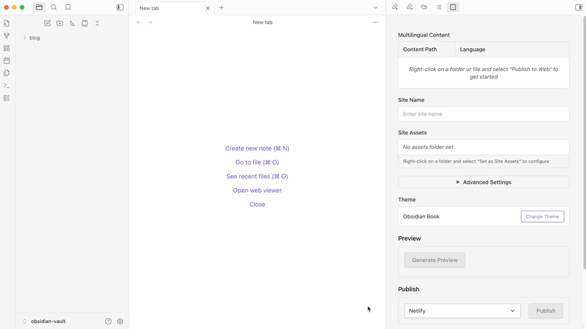

# Friday

**Just Write. MDFriday brings it to life.** MDFriday lets you build and publish professional websites with full control.

## Themes Demo

- Docs: [Book](https://theme-book.mdfriday.com/), [Note](https://theme-note.mdfriday.com/), [Book Lock](https://theme-book-lock.mdfriday.com/)
- Blog: [Beautiful](https://theme-beautiful.mdfriday.com/), [Awesome](https://theme-awesome.mdfriday.com/)
- Project: [Notebook Navigator](https://theme-ob-plugin.mdfriday.com/)
- Resumes and CVs: [Resume](https://theme-resume.mdfriday.com/)
- Landing pages: [Landing](https://theme-landing.mdfriday.com/)
- Slides: [Slides](https://theme-slides.mdfriday.com/)
- Portfolios: [Portfolio](https://theme-portfolio.mdfriday.com/)
- Company: [Company](https://theme-company.mdfriday.com/)

## Demo

### Preview & Publish

### Real-time Preview: What You See Is What You Get

### YouTube Demo

## How it Works

1. Open **Obsidian’s Community Plugins**
2. Search for **Friday** and install
3. Choose a theme from the MDFriday panel
4. Download the theme’s sample notes
5. Right-click a note → **Publish to Web**
6. Click **Preview** to see it live locally

Once previewed, edit the sample notes with your own content —  
and you’ve got your personal site!

You can:
- Export the static site and upload it anywhere
- Or configure cloud settings to **publish directly** with one click

## Why Friday?

- **📝 Flexible Publishing**: Publish individual notes or entire folders with just one click
- **🚀 Lightning Fast Local Preview**: Build and preview instantly on your machine — no waiting, no uploads
- **👀 Real-Time Updates**: See changes immediately as you edit — true what-you-see-is-what-you-get experience  
- **🎨 500+ Beautiful Themes**: Choose from hundreds of professionally designed themes (coming soon...)
- **☁️ Multiple Deployment Options**: Deploy to Netlify, or use FTP for custom hosting
- **📦 Local Export**: Export complete site source code for hosting anywhere you want
- **🔒 Complete Ownership**: Your content, your data, your control — no vendor lock-in
- **🛡️ Privacy First**: All processing happens locally, your content stays private

## More Resources

- **[Official Website](https://mdfriday.com)** - Completely redesigned and upgraded

## Join Us

- **Discord**: [Join our community](https://discord.gg/t7FHJ6qNzT)
- **Wechat**: 

## Acknowledgement

Friday Plugin is fully reimplemented in TypeScript, inspired by [Hugo](https://gohugo.io/)’s philosophy. 
Huge thanks to the Hugo community for the inspiration!

## Support Development

If Friday helps you create amazing websites, consider supporting our development:

