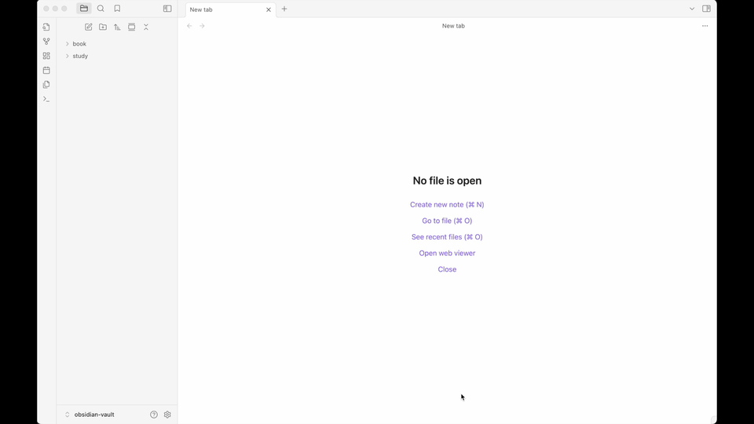
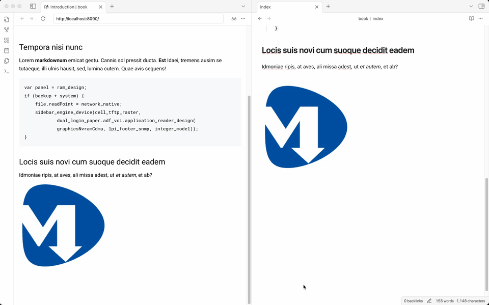
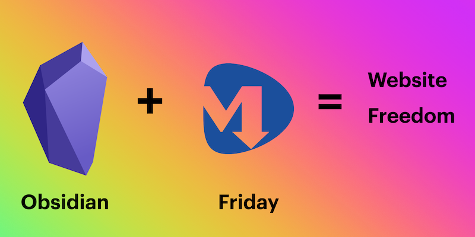

# Friday

**You own it — your notes, your themes, your cloud.**  
MDFriday lets you build and publish with full control.

Transform your Markdown documents into professional websites in minutes. 
Publish individual notes or entire folders, preview locally with real-time updates, then deploy to your choice of hosting platform — or export everything to host anywhere you want.

## Demo

### Multi-Language Support

### Complete Workflow: Build to Publish

### Real-time Preview: What You See Is What You Get

### YouTube Demo

## Why Friday?

- **📝 Flexible Publishing**: Publish individual notes or entire folders with just one click
- **🚀 Lightning Fast Local Preview**: Build and preview instantly on your machine — no waiting, no uploads
- **👀 Real-Time Updates**: See changes immediately as you edit — true what-you-see-is-what-you-get experience  
- **🎨 500+ Beautiful Themes**: Choose from hundreds of professionally designed themes (coming soon...)
- **☁️ Multiple Deployment Options**: Deploy to Netlify, or use FTP for custom hosting
- **📦 Local Export**: Export complete site source code for hosting anywhere you want
- **🔒 Complete Ownership**: Your content, your data, your control — no vendor lock-in
- **🛡️ Privacy First**: All processing happens locally, your content stays private

## Quick Start

1. **Install the Plugin**
   - Search for **Friday** (by sunwei) in Obsidian's community plugins
   - Enable the plugin in your settings
   - Configure your preferred hosting platform - Netlify or FTP

2. **Register Your Account** (Not required for local use)
   - Open Friday settings in Obsidian
   - Create your free account to unlock deployment features

3. **Create & Preview**
   - Write your content in Markdown
   - Choose to publish individual notes or entire folders
   - Choose a theme and preview instantly (Themes are coming soon...)
   - Make changes and watch them update in real-time

4. **Deploy**
   - One-click deployment to Netlify or FTP hosting
   - Or export your complete site source code for custom hosting
   - Your site goes live in minutes

## More Resources

- **[Official Website](https://mdfriday.com)** - Completely redesigned and upgraded
- **[中文官网](https://sunwei.xyz/mdfriday)** - 全新升级的中文版本
- **[Help Documentation](https://help.mdfriday.com)**
- **[Theme Gallery](https://gallery.mdfriday.com)**

## Join Us

- **Discord**: [Join our community](https://discord.gg/hzRZDVeD)
- **Wechat**: 

## Acknowledgement

Friday Plugin is fully reimplemented in TypeScript, inspired by [Hugo](https://gohugo.io/)’s philosophy. 
Huge thanks to the Hugo community for the inspiration!

## Support Development

If Friday helps you create amazing websites, consider supporting our development:

