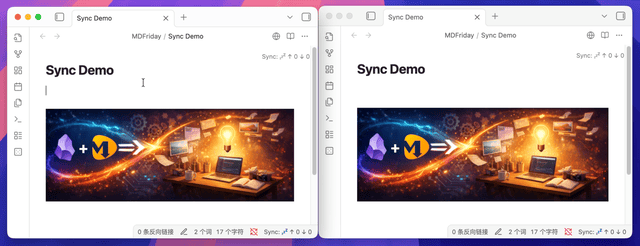
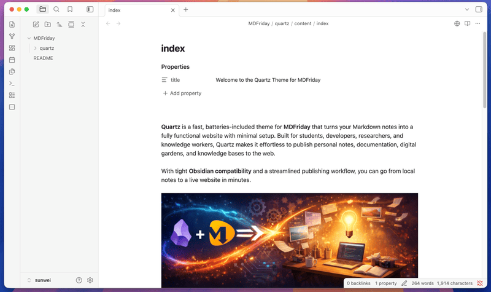

# Friday

## Friday is your digital asset creation assistant

Write in Obsidian. Sync across devices. Publish instantly. Share with the world. Own everything.

---

## ✨ Demos

**Live Sync across devices**:



**Instant Publishing**:



---

## 🎨 Beautiful Themes, Ready to Use

Choose a professional design.
Download sample notes.
Start publishing in minutes.

- 📚 Documentation / Knowledge Base: [Quartz](https://help.mdfriday.com) | [Book](https://mdfriday.com/mdf/themes/book/) | [Note](https://mdfriday.com/mdf/themes/notes/)
- 📰 Blog: [Beautiful](https://mdfriday.com/mdf/themes/beautiful/) | [Awesome](https://mdfriday.com/mdf/themes/awesome/)
- 📄 Resume & Portfolio: [Resume](https://mdfriday.com/mdf/themes/resume/) | [Portfolio](https://sunwei.xyz/)
- 🚀 Landing & Company: [Landing](https://mdfriday.com/mdf/themes/landing/) | [Company](https://mdfriday.com/mdf/themes/company/)
- 🎤 Slides: [Slides](https://mdfriday.com/mdf/themes/slides/)

More themes available inside the plugin.

---

## 📚 Learn More

- Documentation: 👉 [https://help.mdfriday.com/index.html](https://help.mdfriday.com/index.html)
- Website: 👉 [https://mdfriday.com](https://mdfriday.com)
- Community: 👉 [https://discord.gg/t7FHJ6qNzT](https://discord.gg/t7FHJ6qNzT)

---

## 🐳 Self-Hosting with Docker

Deploy your own MDFriday instance on any cloud server with a single command:

```bash
curl -fsSL https://raw.githubusercontent.com/mdfriday/obsidian-friday-plugin/main/docker/install.sh | bash
```

**Requirements:**
- A cloud server with Docker installed
- A domain name pointed to your server
- 5 minutes of your time

The interactive installer will guide you through:
- Docker environment verification
- Domain and server configuration
- Admin account setup
- CouchDB database configuration
- Optional DNS provider setup for automatic HTTPS

**Manual Installation:**

If you prefer to review the script first:

```bash
# Download the installation script
curl -fsSL https://raw.githubusercontent.com/mdfriday/obsidian-friday-plugin/main/docker/install.sh -o install.sh

# Review the script
cat install.sh

# Make it executable and run
chmod +x install.sh
./install.sh
```

**What Gets Installed:**
- 🗄️ CouchDB - for data synchronization
- 🌐 Caddy - reverse proxy with automatic HTTPS
- 🚀 Hugoverse - the MDFriday application server

All services run in Docker containers with automatic health checks and log rotation.

For detailed configuration options, see [`docker/README.md`](docker/README.md).

---

## 🚀 Start Building Today

Your notes are seeds.
Friday helps them grow into assets.

Just write.
Friday brings it to life.

---

## 🙏 Acknowledgements

Friday is inspired by:

- [Hugo](https://github.com/gohugoio/hugo) – static site philosophy
- [LiveSync](https://github.com/vrtmrz/obsidian-livesync) – multi-device synchronization
- [Quartz](https://github.com/jackyzha0/quartz)  – digital garden publishing ideas
