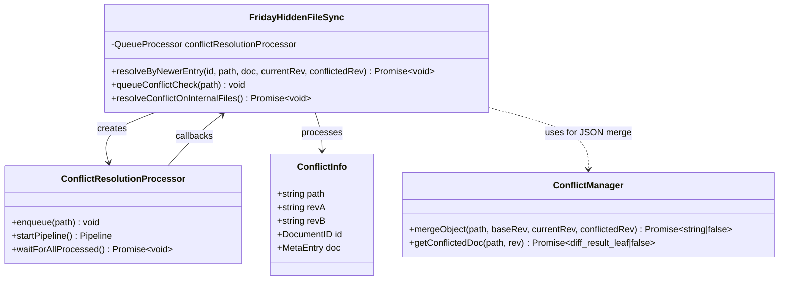
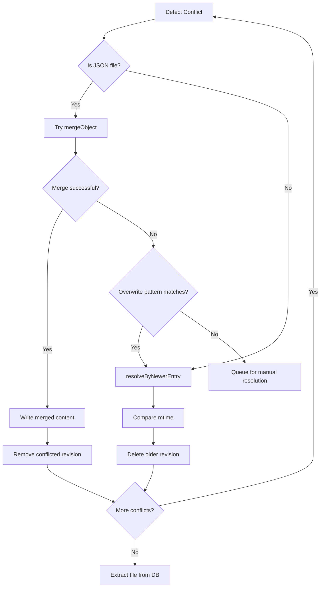

# Conflict Resolution Implementation - Implementation Context

## Implementation Prompt: Hidden File Conflict Resolution

### Requirements Anchoring
Implement complete conflict resolution logic for the FridayHiddenFileSync module by porting livesync's conflict handling mechanisms.
The current implementation detects conflicts but only skips them without resolution, causing plugin files (main.js) to become corrupted or enlarged.
The goal is to properly resolve conflicts following livesync's strategy: **select newer version for binary files, attempt smart merge for JSON files**.

### Business Model


### Solution

1. **Core Merge Functionality Reuse**:
   - **Already ported from livesync**: `ConflictManager` exists in `src/sync/core/managers/ConflictManager.ts`
   - **Access via**: `this.core.managers.conflictManager`
   - **Available methods**:
     | Method | Function | File Types |
     |--------|----------|------------|
     | `mergeObject()` | JSON object-level smart merge | `.json`, `.canvas` |
     | `mergeSensibly()` | Markdown line-level smart merge | `.md` |
     | `tryAutoMerge()` | Auto merge entry point | All supported |
     | `getConflictedDoc()` | Get specific revision document | All |
   - **Principle**: Only implement conflict resolution flow logic, reuse existing merge algorithms

2. **Conflict Resolution Strategy** (matching livesync):
   - **Non-JSON files** (main.js, styles.css, etc.): Select the version with newer `mtime`
   - **JSON files** (data.json, manifest.json, etc.): 
     1. First attempt smart object merge via `mergeObject`
     2. If merge fails, check `syncInternalFileOverwritePatterns`
     3. If pattern matches, select newer version
     4. Otherwise, queue for manual resolution (future: show merge dialog)

3. **Queue-based Processing**:
   - Use `QueueProcessor` from octagonal-wheels for conflict resolution
   - Process conflicts one at a time to avoid race conditions
   - Re-enqueue if more conflicts exist after resolution

4. **Key Difference from Current Implementation**:
   - Current: Skip write when conflicts detected, conflicts persist forever
   - Fixed: Actively resolve conflicts by selecting appropriate version

### Structure

#### Inheritance Relationships
1. `ConflictResolutionProcessor` - Instance of QueueProcessor for batch processing
2. `ConflictInfo` - Interface for conflict data passed through pipeline

#### Dependencies
1. FridayHiddenFileSync depends on:
   - `core.localDatabase.getRaw()` - Get document with specific revision
   - `core.localDatabase.removeRevision()` - Delete losing revision
   - `core.managers.conflictManager` - For JSON object merge (existing in core)
2. Uses `getComparingMTime()` from hiddenFileUtils for mtime comparison

#### Process Flow


### Tasks

#### Task 1: Add Conflict Resolution Types
1. **Responsibility**: Define types for conflict resolution
2. **File**: `src/sync/features/HiddenFileSync/index.ts` (add to existing)
3. **New Types**:
   ```typescript
   interface ConflictInfo {
       path: FilePathWithPrefix;
       revA: string;  // Current revision
       revB: string;  // Conflicted revision
       id: DocumentID;
       doc: MetaEntry;
   }
   ```

#### Task 2: Implement resolveByNewerEntry Method
1. **Responsibility**: Select and keep the newer revision based on mtime
2. **File**: `src/sync/features/HiddenFileSync/index.ts`
3. **Implementation**:
   ```typescript
   /**
    * Resolve conflict by selecting the revision with newer mtime
    * This is used for non-JSON files like main.js, styles.css
    * Source: livesync CmdHiddenFileSync.ts lines 653-678
    */
   async resolveByNewerEntry(
       id: DocumentID,
       path: FilePathWithPrefix,
       currentDoc: MetaEntry,
       currentRev: string,
       conflictedRev: string
   ): Promise<void> {
       const localDB = this.core.localDatabase;
       if (!localDB) return;
       
       // Get the conflicted document
       const conflictedDoc = await localDB.getRaw<MetaEntry>(id, { rev: conflictedRev });
       
       // Compare mtime to determine which is newer
       const mtimeCurrent = getComparingMTime(currentDoc, true);
       const mtimeConflicted = getComparingMTime(conflictedDoc, true);
       
       // Delete the older revision
       const delRev = mtimeCurrent < mtimeConflicted ? currentRev : conflictedRev;
       await localDB.removeRevision(id, delRev);
       
       Logger(`[HiddenFileSync] Conflict resolved, older revision deleted: ${path}`, LOG_LEVEL_INFO);
       
       // Check if more conflicts exist
       const updated = await localDB.getRaw(id, { conflicts: true });
       if (!updated._conflicts?.length) {
           // No more conflicts, extract file to storage
           await this.extractInternalFileFromDatabase(stripAllPrefixes(path) as FilePath);
       } else {
           // More conflicts, re-queue
           this.queueConflictCheck(path);
       }
   }
   ```
4. **Source Reference**: `livesync/src/features/HiddenFileSync/CmdHiddenFileSync.ts` lines 653-678

#### Task 3: Implement Conflict Resolution Queue
1. **Responsibility**: Create queue processor for handling conflicts
2. **File**: `src/sync/features/HiddenFileSync/index.ts`
3. **Implementation**:
   ```typescript
   import { QueueProcessor } from "octagonal-wheels/concurrency/processor";
   
   // Add to class properties
   private conflictResolutionProcessor: QueueProcessor<FilePathWithPrefix[], ConflictInfo[]>;
   
   // Initialize in constructor or onload
   this.conflictResolutionProcessor = new QueueProcessor(
       async (paths: FilePathWithPrefix[]) => {
           const path = paths[0];
           const localDB = this.core.localDatabase;
           if (!localDB) return [];
           
           try {
               const id = await this.core.path2id(addPrefix(path, ICHeader), ICHeader);
               const doc = await localDB.getRaw<MetaEntry>(id, { conflicts: true });
               
               if (!doc._conflicts?.length) return [];
               
               Logger(`[HiddenFileSync] Resolving conflict: ${path}`, LOG_LEVEL_INFO);
               const conflicts = doc._conflicts.sort(
                   (a, b) => Number(a.split("-")[0]) - Number(b.split("-")[0])
               );
               const revA = doc._rev!;
               const revB = conflicts[0];
               
               // For JSON files, try smart merge first
               if (path.endsWith(".json")) {
                   const merged = await this.tryMergeJSON(id, path, doc, revA, revB);
                   if (merged) return [];
                   
                   // Check overwrite patterns
                   const overwritePatterns = parsePatterns(
                       this.settings.syncInternalFileOverwritePatterns || ""
                   );
                   if (matchesAnyPattern(stripAllPrefixes(path), overwritePatterns)) {
                       await this.resolveByNewerEntry(id, path, doc, revA, revB);
                       return [];
                   }
                   
                   // Return for manual resolution (future)
                   return [{ path, revA, revB, id, doc }];
               }
               
               // Non-JSON files: always resolve by newer
               await this.resolveByNewerEntry(id, path, doc, revA, revB);
               return [];
           } catch (ex) {
               Logger(`[HiddenFileSync] Conflict resolution failed: ${path}`, LOG_LEVEL_VERBOSE);
               Logger(ex, LOG_LEVEL_VERBOSE);
               return [];
           }
       },
       {
           suspended: false,
           batchSize: 1,
           concurrentLimit: 1,  // Process one at a time
           delay: 10,
           keepResultUntilDownstreamConnected: false,
           yieldThreshold: 10,
       }
   );
   ```
4. **Source Reference**: `livesync/src/features/HiddenFileSync/CmdHiddenFileSync.ts` lines 679-770

#### Task 4: Implement JSON Merge Helper
1. **Responsibility**: Attempt smart merge for JSON files using ConflictManager
2. **File**: `src/sync/features/HiddenFileSync/index.ts`
3. **Implementation**:
   ```typescript
   /**
    * Try to merge JSON files using object-level merge
    * Returns true if merge was successful
    */
   private async tryMergeJSON(
       id: DocumentID,
       path: FilePathWithPrefix,
       doc: MetaEntry,
       currentRev: string,
       conflictedRev: string
   ): Promise<boolean> {
       const localDB = this.core.localDatabase;
       if (!localDB) return false;
       
       try {
           // Find common base revision
           const revFrom = await localDB.getRaw<MetaEntry>(id, { revs_info: true });
           const conflictedRevNo = Number(conflictedRev.split("-")[0]);
           const commonBase = revFrom._revs_info
               ?.filter(e => e.status === "available" && Number(e.rev.split("-")[0]) < conflictedRevNo)
               ?.[0]?.rev ?? "";
           
           if (!commonBase) return false;
           
           // Use ConflictManager for merge
           const conflictManager = this.core.managers?.conflictManager;
           if (!conflictManager) return false;
           
           const result = await conflictManager.mergeObject(
               doc.path,
               commonBase,
               currentRev,
               conflictedRev
           );
           
           if (!result) return false;
           
           // Write merged content
           const filename = stripAllPrefixes(path) as FilePath;
           await this.ensureDir(filename);
           const stat = await this.writeFile(filename, result);
           
           if (!stat) {
               throw new Error(`Failed to write merged file: ${filename}`);
           }
           
           // Store merged content and remove conflicted revision
           await this.storeInternalFileToDatabase({ path: filename, ...stat });
           await this.extractInternalFileFromDatabase(filename);
           await localDB.removeRevision(id, conflictedRev);
           
           // Re-check for more conflicts
           this.queueConflictCheck(path);
           
           Logger(`[HiddenFileSync] JSON merge successful: ${path}`, LOG_LEVEL_INFO);
           return true;
       } catch (ex) {
           Logger(`[HiddenFileSync] JSON merge failed: ${path}`, LOG_LEVEL_VERBOSE);
           Logger(ex, LOG_LEVEL_VERBOSE);
           return false;
       }
   }
   ```
4. **Source Reference**: `livesync/src/features/HiddenFileSync/CmdHiddenFileSync.ts` lines 694-724

#### Task 5: Add queueConflictCheck Method
1. **Responsibility**: Helper to enqueue conflict check
2. **File**: `src/sync/features/HiddenFileSync/index.ts`
3. **Implementation**:
   ```typescript
   /**
    * Queue a path for conflict resolution
    */
   queueConflictCheck(path: FilePathWithPrefix): void {
       this.conflictResolutionProcessor.enqueue(path);
   }
   ```

#### Task 6: Update extractInternalFileFromDatabase
1. **Responsibility**: Trigger conflict resolution instead of just skipping
2. **File**: `src/sync/features/HiddenFileSync/index.ts`
3. **Changes**:
   ```typescript
   // BEFORE (current implementation)
   if ((metaOnDB as any)._conflicts?.length) {
       Logger(`[HiddenFileSync] ${storageFilePath} has conflicts, skipping write`, LOG_LEVEL_INFO);
       return false;
   }
   
   // AFTER (fixed implementation)
   if ((metaOnDB as any)._conflicts?.length) {
       Logger(`[HiddenFileSync] ${storageFilePath} has conflicts, queuing resolution`, LOG_LEVEL_INFO);
       const prefixedPath = addPrefix(storageFilePath, ICHeader);
       this.queueConflictCheck(prefixedPath);
       return false;  // Don't write until conflict resolved
   }
   ```

#### Task 7: Implement resolveConflictOnInternalFiles
1. **Responsibility**: Scan and resolve all conflicted internal files
2. **File**: `src/sync/features/HiddenFileSync/index.ts`
3. **Implementation**:
   ```typescript
   /**
    * Scan all internal files for conflicts and queue resolution
    * Called during initialization
    */
   async resolveConflictOnInternalFiles(): Promise<void> {
       const localDB = this.core.localDatabase;
       if (!localDB) return;
       
       Logger("[HiddenFileSync] Scanning for conflicted files...", LOG_LEVEL_INFO);
       
       // Find all conflicted internal files
       const conflicted = localDB.findEntries(ICHeader, ICHeaderEnd, { conflicts: true });
       
       for await (const doc of conflicted) {
           if (!("_conflicts" in doc)) continue;
           if (!doc._conflicts?.length) continue;
           if (isInternalMetadata(doc._id)) {
               this.queueConflictCheck(doc.path);
           }
       }
       
       // Wait for all conflicts to be processed
       await this.conflictResolutionProcessor.startPipeline().waitForAllProcessed();
       
       Logger("[HiddenFileSync] Conflict resolution complete", LOG_LEVEL_INFO);
   }
   ```
4. **Source Reference**: `livesync/src/features/HiddenFileSync/CmdHiddenFileSync.ts` lines 635-651

#### Task 8: Update onload to Resolve Existing Conflicts
1. **Responsibility**: Check for conflicts when module loads
2. **File**: `src/sync/features/HiddenFileSync/index.ts`
3. **Changes**:
   ```typescript
   async onload(): Promise<void> {
       Logger("[HiddenFileSync] Module loaded", LOG_LEVEL_INFO);
       
       // Initialize conflict resolution processor
       this.initConflictResolutionProcessor();
       
       // Clear caches
       this._fileInfoLastProcessed.clear();
       this._fileInfoLastKnown.clear();
       this._databaseInfoLastProcessed.clear();
       this.cacheFileRegExps.clear();
       
       // Resolve any existing conflicts
       await this.resolveConflictOnInternalFiles();
       
       // Start periodic scan if enabled
       this.startPeriodicScan();
   }
   ```

### Common Tasks

1. **Import Requirements**:
   ```typescript
   import { QueueProcessor } from "octagonal-wheels/concurrency/processor";
   ```

2. **Logging Standards**:
   - Format: `[HiddenFileSync] Conflict resolved: ${path}`
   - Format: `[HiddenFileSync] JSON merge successful: ${path}`
   - Format: `[HiddenFileSync] Older revision deleted: ${path}`

3. **Error Handling**:
   - Wrap all conflict operations in try-catch
   - Log errors at verbose level
   - Continue processing other conflicts on failure

### Constraints

1. **Functional Constraints**:
   - Must resolve non-JSON files by selecting newer mtime version
   - Must attempt JSON merge before fallback to newer version
   - Must not corrupt binary files (main.js, images)
   - Must handle multiple consecutive conflicts
   - Must not block main sync during conflict resolution

2. **Performance Constraints**:
   - Process conflicts one at a time (concurrentLimit: 1)
   - Small delay between conflict resolutions (10ms)
   - Don't block UI during processing

3. **Compatibility Constraints**:
   - Must use existing ConflictManager from core
   - Must be compatible with livesync's PouchDB conflict format
   - Must handle both `_conflicts` array format

4. **Data Integrity Constraints**:
   - Never merge binary files (main.js, images, etc.)
   - Only merge JSON files when no key conflicts exist
   - Always verify write success before removing conflicted revision

### File Type Handling

| File Extension | Conflict Strategy | Merge Attempt |
|----------------|-------------------|---------------|
| `.json` | Smart object merge, fallback to newer | Yes |
| `.js` | Select newer mtime | No |
| `.css` | Select newer mtime | No |
| `.md` (if any) | Sensible line merge | Yes |
| Other | Select newer mtime | No |

### Source Code References

| Component | Source File | Lines |
|-----------|-------------|-------|
| resolveByNewerEntry | `livesync/src/features/HiddenFileSync/CmdHiddenFileSync.ts` | 653-678 |
| conflictResolutionProcessor | Same file | 679-770 |
| JSON merge logic | Same file | 694-724 |
| resolveConflictOnInternalFiles | Same file | 635-651 |
| mergeObject | `src/sync/core/managers/ConflictManager.ts` | 259-323 |
| getComparingMTime | `src/sync/utils/hiddenFileUtils.ts` | existing |

### Testing Scenarios

1. **Binary File Conflict (main.js)**:
   - Device A modifies plugin, uploads main.js
   - Device B modifies same plugin (different time), uploads main.js
   - Conflict detected
   - Expected: Newer mtime version wins, file stays valid

2. **JSON File Conflict (data.json)**:
   - Device A changes setting X
   - Device B changes setting Y
   - Conflict detected
   - Expected: Both changes merged (if no key conflict)

3. **Multiple Conflicts**:
   - Same file modified multiple times on different devices
   - All revisions conflict
   - Expected: Process sequentially until resolved

### Implementation Priority

| Priority | Task | Estimated Effort |
|----------|------|------------------|
| P0 | Task 2: resolveByNewerEntry | 0.5 day |
| P0 | Task 3: Conflict Queue | 0.5 day |
| P0 | Task 6: Update extraction | 0.25 day |
| P1 | Task 4: JSON Merge | 0.5 day |
| P1 | Task 7: Scan conflicts | 0.25 day |
| P2 | Task 8: onload update | 0.25 day |

**Total Estimated Effort: 2-3 days**

