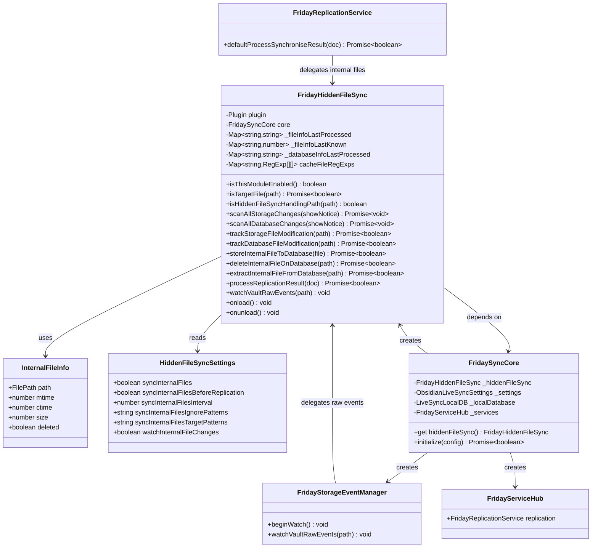

# Hidden File Sync Implementation - Implementation Context

## Implementation Prompt: .obsidian File Synchronization

### Requirements Anchoring
Implement a complete hidden file synchronization module for the Friday plugin by porting livesync's `HiddenFileSync` functionality. 
This enables automatic synchronization of `.obsidian` folder contents (themes, plugins, snippets, and settings) with the default configuration being "enabled", allowing users to optionally disable it in settings. 
he goal is to provide a seamless, low-burden experience for users who want their Obsidian configurations synced across devices.

### Business Model


### Solution
1. **Module Porting Strategy**:
   - Port livesync's `CmdHiddenFileSync.ts` (1930 lines) to Friday's architecture
   - Adapt class inheritance from `LiveSyncCommands` to standalone class with `FridaySyncCore` dependency
   - Replace service access patterns to use Friday's `FridayServiceHub`
   - Maintain core synchronization logic while simplifying advanced features

2. **Integration Architecture**:
   - Create `FridayHiddenFileSync` class in `src/sync/features/HiddenFileSync/`
   - Integrate with `FridaySyncCore` as an optional module (default enabled)
   - Hook into `FridayStorageEventManager` for raw vault events
   - Hook into `FridayReplicationService` for processing internal file documents

3. **Default Configuration** (following Obsidian official sync best practices):
   - Enable hidden file sync by default (`syncInternalFiles: true`)
   - Watch internal file changes in real-time (`watchInternalFileChanges: true`)
   - Periodic scan interval: 60 seconds
   - Default ignore patterns (exclude workspace state and cache):
     - `\.obsidian\/workspace` - Workspace layout state (device-specific)
     - `\.obsidian\/workspace\.json` - Workspace JSON
     - `\.obsidian\/workspace-mobile\.json` - Mobile workspace
     - `\.obsidian\/cache` - Obsidian cache files
     - `\/node_modules\/` - Node modules (if any)
     - `\/\.git\/` - Git directories

### Structure

#### Inheritance Relationships
1. `FridayHiddenFileSync` - Standalone class (no inheritance), adapted from `LiveSyncCommands`
2. `InternalFileInfo` - Interface for hidden file metadata
3. `HiddenFileSyncSettings` - Interface extending sync settings

#### Dependencies
1. FridayHiddenFileSync depends on FridaySyncCore for:
   - `core.localDatabase` - Database operations
   - `core.kvDB` - Key-value storage for caching
   - `core.services` - Service hub access
   - `core.getSettings()` - Configuration access
2. FridaySyncCore creates and manages FridayHiddenFileSync instance
3. FridayStorageEventManager delegates raw events to FridayHiddenFileSync
4. FridayReplicationService delegates internal file processing to FridayHiddenFileSync

#### Layered Architecture
1. **Event Layer**: FridayStorageEventManager captures vault raw events for `.obsidian` files
2. **Sync Module Layer**: FridayHiddenFileSync handles bidirectional sync logic
3. **Service Layer**: FridayServiceHub coordinates replication result processing
4. **Core Layer**: FridaySyncCore manages module lifecycle and configuration
5. **Database Layer**: LiveSyncLocalDB stores internal file documents with `i:` prefix

### Tasks

#### Task 1: Update Type Definitions
1. **Responsibility**: Add hidden file sync related types and constants
2. **File**: `src/sync/types.ts`
3. **New Types**:
   ```typescript
   // Internal file document prefix constants
   export const ICHeader = "i:";
   export const ICHeaderEnd = "i;";
   export const ICHeaderLength = ICHeader.length;

   // Internal file info interface
   export interface InternalFileInfo {
       path: FilePath;
       mtime: number;
       ctime: number;
       size: number;
       deleted?: boolean;
   }

   /**
    * Default ignore patterns for .obsidian sync
    * Following Obsidian official sync best practices:
    * - workspace*: Device-specific layout state
    * - cache: Temporary files, regenerated automatically
    */
   export const DEFAULT_INTERNAL_IGNORE_PATTERNS = [
       "\\.obsidian\\/workspace",           // Workspace layout
       "\\.obsidian\\/workspace\\.json",    // Workspace JSON
       "\\.obsidian\\/workspace-mobile\\.json", // Mobile workspace
       "\\.obsidian\\/cache",               // Cache directory
       "\\/node_modules\\/",                // Node modules
       "\\/\\.git\\/",                      // Git directories
   ].join(",");

   // Hidden file sync settings interface
   export interface HiddenFileSyncSettings {
       syncInternalFiles: boolean;
       syncInternalFilesBeforeReplication: boolean;
       syncInternalFilesInterval: number;
       syncInternalFilesIgnorePatterns: string;
       syncInternalFilesTargetPatterns: string;
       syncInternalFileOverwritePatterns: string;
       watchInternalFileChanges: boolean;
       suppressNotifyHiddenFilesChange: boolean;
   }
   ```

#### Task 2: Create Utility Functions
1. **Responsibility**: Port essential utility functions from livesync
2. **File**: `src/sync/utils/hiddenFileUtils.ts`
3. **Functions to Port**:
   - `isInternalMetadata(id: string): boolean` - Check if ID has `i:` prefix
   - `stripInternalMetadataPrefix<T>(id: T): T` - Remove `i:` prefix
   - `compareMTime(a: number, b: number): CompareResult` - Compare modification times
   - `markChangesAreSame(path, mtime1, mtime2): void` - Mark mtime pair as same
   - `unmarkChanges(path): void` - Remove mtime mark
   - `getDocProps(doc): DocProps` - Extract document properties for logging
   - `onlyInNTimes(n, fn): Function` - Progress notification helper
4. **Source Reference**: `livesync/src/common/utils.ts` lines 145-200

#### Task 3: Create FridayHiddenFileSync Class Skeleton
1. **Responsibility**: Create the main hidden file sync module with class structure
2. **File**: `src/sync/features/HiddenFileSync/index.ts`
3. **Class Structure**:
   ```typescript
   export class FridayHiddenFileSync {
       private plugin: Plugin;
       private core: FridaySyncCore;
       
       // Cache management (from livesync lines 288-290)
       private _fileInfoLastProcessed: Map<string, string>;
       private _fileInfoLastKnown: Map<string, number>;
       private _databaseInfoLastProcessed: Map<string, string>;
       
       // RegExp cache (from livesync line 860)
       private cacheFileRegExps: Map<string, RegExp[][]>;
       
       constructor(plugin: Plugin, core: FridaySyncCore);
       
       // Core API methods
       isThisModuleEnabled(): boolean;
       async isTargetFile(path: FilePath): Promise<boolean>;
       
       // Lifecycle methods
       onload(): void;
       onunload(): void;
   }
   ```
4. **Source Reference**: `livesync/src/features/HiddenFileSync/CmdHiddenFileSync.ts`

#### Task 4: Implement Target File Detection
1. **Responsibility**: Port file filtering logic to determine sync targets
2. **Methods to Implement**:
   - `isHiddenFileSyncHandlingPath(path: FilePath): boolean`
     - Logic: Return `path.startsWith(".") && !path.startsWith(".trash")`
     - Source: livesync lines 942-945
   - `isTargetFileInPatterns(path: string): boolean`
     - Logic: Check against ignore and target pattern RegExps
     - Source: livesync lines 885-905
   - `isNotIgnoredByCustomisationSync(path: string): boolean`
     - Logic: Check customization sync exclusion list
     - Source: livesync lines 935-940
   - `async isTargetFile(path: FilePath): Promise<boolean>`
     - Logic: Combine all checks and ignore file verification
     - Source: livesync lines 948-960

#### Task 5: Implement Storage Operations
1. **Responsibility**: Port file read/write operations for hidden files
2. **Methods to Implement**:
   - `async loadFileWithInfo(path: FilePath): Promise<UXFileInfo>`
     - Logic: Read hidden file content and stat
     - Source: livesync lines 261-286
   - `async writeFile(path, data, opt): Promise<UXStat | null>`
     - Logic: Write hidden file with options
     - Source: livesync lines 372-377
   - `async __removeFile(path): Promise<"OK" | "ALREADY" | false>`
     - Logic: Remove hidden file with status
     - Source: livesync lines 379-395
   - `async ensureDir(path): Promise<void>`
     - Logic: Ensure directory exists
     - Source: livesync lines 365-370

#### Task 6: Implement Database Operations
1. **Responsibility**: Port database storage and retrieval for internal files
2. **Methods to Implement**:
   - `async storeInternalFileToDatabase(file: InternalFileInfo | UXFileInfo, forceWrite?: boolean): Promise<boolean | undefined>`
     - Logic: Save hidden file to local database with `i:` prefix
     - Source: livesync lines 1441-1490
     - Key steps:
       1. Check ignore patterns
       2. Load existing document if any
       3. Compare content to detect actual changes
       4. Create SavingEntry with proper metadata
       5. Put to database with `localDatabase.putDBEntry()`
   - `async deleteInternalFileOnDatabase(path: FilePath, forceWrite?: boolean): Promise<boolean | undefined>`
     - Logic: Mark hidden file as deleted in database
     - Source: livesync lines 1492-1543
   - `async extractInternalFileFromDatabase(path: FilePath, force?: boolean, ...): Promise<boolean | undefined>`
     - Logic: Retrieve and write hidden file from database to storage
     - Source: livesync lines 1549-1638

#### Task 7: Implement Scan Operations
1. **Responsibility**: Port scanning logic for detecting changes
2. **Methods to Implement**:
   - `async scanInternalFileNames(): Promise<FilePath[]>`
     - Logic: List all hidden files in vault
     - Source: livesync lines 1809-1816
   - `async scanAllStorageChanges(showNotice?: boolean, ...): Promise<void>`
     - Logic: Scan storage for changes and sync to database
     - Source: livesync lines 494-535
   - `async scanAllDatabaseChanges(showNotice?: boolean, ...): Promise<void>`
     - Logic: Scan database for changes and sync to storage
     - Source: livesync lines 1069-1091
   - `async trackStorageFileModification(path: FilePath, ...): Promise<boolean | undefined>`
     - Logic: Track individual file modification from storage
     - Source: livesync lines 540-627
   - `async trackDatabaseFileModification(path: FilePath, ...): Promise<boolean>`
     - Logic: Track individual file modification from database
     - Source: livesync lines 1114-1158

#### Task 8: Implement Cache Management
1. **Responsibility**: Port cache utilities for tracking processed files
2. **Methods to Implement**:
   - `statToKey(stat: UXStat | null): string`
     - Source: livesync lines 292-294
   - `docToKey(doc: LoadedEntry | MetaEntry): string`
     - Source: livesync lines 295-297
   - `updateLastProcessedFile(file, keySrc): void`
     - Source: livesync lines 303-309
   - `updateLastProcessedDatabase(file, keySrc): void`
     - Source: livesync lines 345-348
   - `updateLastProcessed(path, db, stat): void`
     - Source: livesync lines 349-359
   - `getLastProcessedFileKey(file): string | undefined`
     - Source: livesync lines 338-340

#### Task 9: Implement Event Processing
1. **Responsibility**: Port event handlers for replication results
2. **Methods to Implement**:
   - `async processReplicationResult(doc: LoadedEntry): Promise<boolean>`
     - Logic: Handle incoming replicated internal file documents
     - Source: livesync lines 847-854
   - `watchVaultRawEvents(path: FilePath): void`
     - Logic: Handle vault raw events for internal files
     - Will be called from FridayStorageEventManager

#### Task 10: Integrate with FridaySyncCore
1. **Responsibility**: Add HiddenFileSync module to core initialization
2. **File**: `src/sync/FridaySyncCore.ts`
3. **Changes**:
   ```typescript
   // Add import
   import { FridayHiddenFileSync } from "./features/HiddenFileSync";
   
   // Add property
   private _hiddenFileSync: FridayHiddenFileSync | null = null;
   
   // In initialize() method, add:
   if (config.syncInternalFiles !== false) {
       this._hiddenFileSync = new FridayHiddenFileSync(this.plugin, this);
       await this._hiddenFileSync.onload();
   }
   
   // Add getter
   get hiddenFileSync(): FridayHiddenFileSync | null {
       return this._hiddenFileSync;
   }
   ```
4. **Update SyncConfig Interface**:
   ```typescript
   export interface SyncConfig {
       // ... existing fields ...
       syncInternalFiles?: boolean;  // Default: true
       syncInternalFilesBeforeReplication?: boolean;
       syncInternalFilesInterval?: number;
       watchInternalFileChanges?: boolean;
   }
   ```

#### Task 11: Integrate with FridayStorageEventManager
1. **Responsibility**: Add raw event handling for hidden files
2. **File**: `src/sync/FridayStorageEventManager.ts`
3. **Changes**:
   ```typescript
   // In beginWatch() method, add raw event listener:
   // @ts-ignore - Internal Obsidian API
   this.plugin.registerEvent(
       this.plugin.app.vault.on("raw", this.watchVaultRawEvents.bind(this))
   );
   
   // Add new method:
   private watchVaultRawEvents(path: FilePath): void {
       const hiddenFileSync = this.core.hiddenFileSync;
       if (hiddenFileSync && hiddenFileSync.isThisModuleEnabled()) {
           hiddenFileSync.watchVaultRawEvents(path);
       }
   }
   ```

#### Task 12: Integrate with FridayReplicationService
1. **Responsibility**: Handle internal file documents in replication
2. **File**: `src/sync/FridayServiceHub.ts`
3. **Changes in `defaultProcessSynchroniseResult`**:
   ```typescript
   private async defaultProcessSynchroniseResult(doc: MetaEntry): Promise<boolean> {
       // Check if internal file (i: prefix)
       if (isInternalMetadata(doc._id)) {
           const hiddenFileSync = this.core.hiddenFileSync;
           if (hiddenFileSync && hiddenFileSync.isThisModuleEnabled()) {
               return await hiddenFileSync.processReplicationResult(doc as LoadedEntry);
           }
           return true; // Skip if module disabled
       }
       
       // ... existing normal file processing logic ...
   }
   ```

### Common Tasks

1. **Logging Standards**:
   - Use `Logger()` from livesync core for consistent logging
   - Log levels: `LOG_LEVEL_INFO`, `LOG_LEVEL_VERBOSE`, `LOG_LEVEL_NOTICE`
   - Format: `STORAGE --> DB:${path}: (hidden) ${status}`
   - Format: `STORAGE <-- DB:${path}: written (hidden) ${status}`

2. **Error Handling**:
   - Wrap database operations in try-catch blocks
   - Log errors at verbose level with stack traces
   - Return false/undefined on failure, allowing caller to handle

3. **Async Patterns**:
   - Use `serialized()` from octagonal-wheels for sequential file operations
   - Use `skipIfDuplicated()` for preventing duplicate scans
   - Use `Semaphore()` for limiting concurrent operations

4. **Cache Patterns**:
   - Use `autosaveCache()` pattern for persistent caches in kvDB
   - Clear caches on settings change
   - Use Map for in-memory caches with proper cleanup

5. **Path Handling**:
   - Use `addPrefix()` and `stripAllPrefixes()` from livesync path utilities
   - Internal files stored with `i:` prefix in database
   - Storage paths without prefix

### Constraints

1. **Functional Constraints**:
   - Must sync `.obsidian/` files following best practices (exclude workspace/cache)
   - Must exclude `.trash/` folder from sync
   - Must exclude device-specific files by default (workspace state, cache)
   - Must handle both text and binary files
   - Must detect and skip unchanged files (content comparison)
   - Must track processed files to avoid duplicate processing

2. **Performance Constraints**:
   - Use content comparison before writing to avoid unnecessary I/O
   - Cache file metadata to reduce stat() calls
   - Limit concurrent file operations with semaphore
   - Debounce rapid file changes

3. **Compatibility Constraints**:
   - Must be compatible with existing FridaySyncCore architecture
   - Must not break existing normal file sync functionality
   - Must work with livesync's database format (`i:` prefix for internal files)
   - Must handle both encrypted and unencrypted databases

4. **Configuration Constraints**:
   - Default: `syncInternalFiles: true`
   - Default: `watchInternalFileChanges: true`
   - Default: `syncInternalFilesInterval: 60` (seconds)
   - Default ignore patterns follow Obsidian official sync best practices:
     - Exclude `workspace*.json` (device-specific layout)
     - Exclude `.obsidian/cache` (regenerated automatically)
     - Exclude `node_modules` and `.git` directories
   - Allow user to disable via settings
   - Allow user to customize ignore patterns

5. **Data Constraints**:
   - Internal files use `i:` prefix in document ID
   - File paths stored relative to vault root
   - mtime/ctime preserved for conflict resolution
   - Content stored as blob for binary safety

6. **Integration Constraints**:
   - Hook into vault `raw` events for real-time monitoring
   - Hook into replication service for incoming document handling
   - Integrate with existing FridayStorageEventManager patterns
   - Use existing kvDB for persistent caching

### File Structure

```
src/sync/
├── features/
│   └── HiddenFileSync/
│       ├── index.ts              # Main FridayHiddenFileSync class (~800 lines)
│       └── types.ts              # Module-specific types (~30 lines)
├── utils/
│   └── hiddenFileUtils.ts        # Utility functions (~100 lines)
├── FridaySyncCore.ts             # Updated: integrate HiddenFileSync
├── FridayStorageEventManager.ts  # Updated: add raw event handling
├── FridayServiceHub.ts           # Updated: handle internal files
├── types.ts                      # Updated: add hidden file types
└── index.ts                      # Updated: export new module
```

### Default Settings

Following Obsidian official sync best practices, exclude device-specific state and cache files:

```typescript
/**
 * Default ignore patterns for .obsidian sync
 * These patterns follow Obsidian official sync best practices:
 * - workspace*: Device-specific layout state, different per device
 * - cache: Temporary cache files, regenerated automatically
 * - node_modules/.git: Development artifacts
 */
const DEFAULT_INTERNAL_IGNORE_PATTERNS = [
    "\\.obsidian\\/workspace",           // Workspace layout (device-specific)
    "\\.obsidian\\/workspace\\.json",    // Workspace JSON
    "\\.obsidian\\/workspace-mobile\\.json", // Mobile workspace
    "\\.obsidian\\/cache",               // Cache directory
    "\\/node_modules\\/",                // Node modules
    "\\/\\.git\\/",                      // Git directories
].join(",");

const defaultHiddenFileSyncSettings: HiddenFileSyncSettings = {
    syncInternalFiles: true,                    // Enable by default
    syncInternalFilesBeforeReplication: true,   // Scan before sync
    syncInternalFilesInterval: 60,              // 60 second periodic scan
    syncInternalFilesIgnorePatterns: DEFAULT_INTERNAL_IGNORE_PATTERNS,  // Best practice excludes
    syncInternalFilesTargetPatterns: "",        // Sync all non-ignored hidden files
    syncInternalFileOverwritePatterns: "",      // No auto-overwrite
    watchInternalFileChanges: true,             // Real-time monitoring
    suppressNotifyHiddenFilesChange: false,     // Show notifications
};
```

**What gets synced by default:**
| Category | Synced | Examples |
|----------|--------|----------|
| ✅ Core Settings | Yes | `app.json`, `appearance.json`, `core-plugins.json` |
| ✅ Themes | Yes | `.obsidian/themes/*` |
| ✅ CSS Snippets | Yes | `.obsidian/snippets/*.css` |
| ✅ Plugins | Yes | `.obsidian/plugins/*/manifest.json`, `main.js`, `data.json` |
| ✅ Hotkeys | Yes | `hotkeys.json` |
| ❌ Workspace | No | `workspace.json`, `workspace-mobile.json` (device-specific) |
| ❌ Cache | No | `.obsidian/cache/*` (regenerated) |

### Source Code References

| Component | Source File | Lines |
|-----------|-------------|-------|
| Main Class | `livesync/src/features/HiddenFileSync/CmdHiddenFileSync.ts` | 1-1930 |
| Target Detection | Same file | 860-960 |
| Storage Ops | Same file | 261-395 |
| Database Ops | Same file | 1441-1638 |
| Scan Logic | Same file | 494-535, 1069-1091 |
| Cache Mgmt | Same file | 288-430 |
| Event Handling | `livesync/src/modules/coreObsidian/storageLib/StorageEventManager.ts` | 219-240 |
| Utilities | `livesync/src/common/utils.ts` | 145-200 |
| Types | `livesync/src/common/types.ts` | 52-68 |
