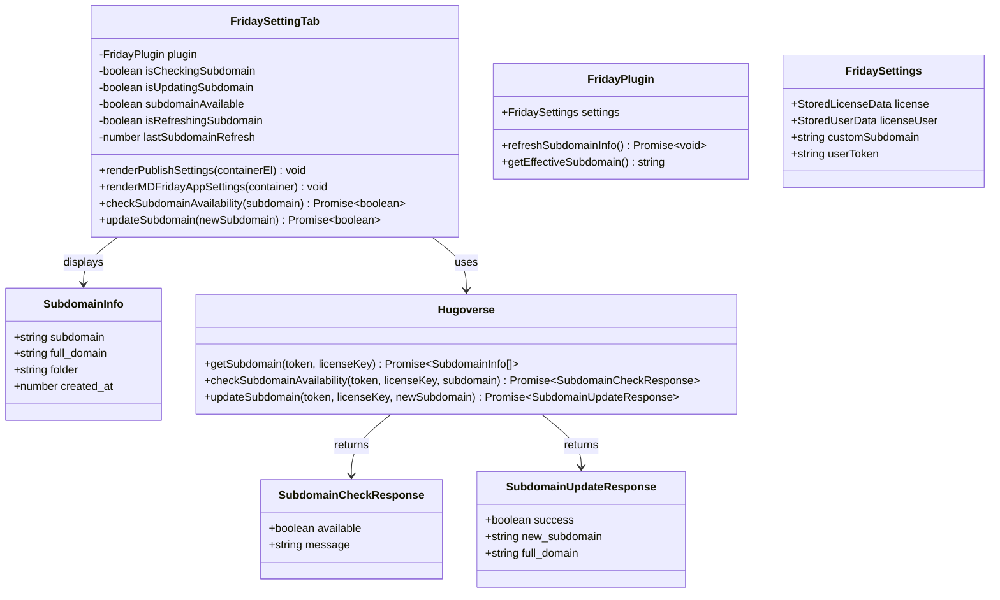

# MDFriday App Subdomain Configuration - Implementation Context

## Implementation Prompt: Subdomain Management in Publish Settings

### Requirements Anchoring
Add a new "MDFriday App" section to the Publish Settings that allows users to view and configure their personal subdomain. The subdomain is used for publishing sites to `xxxxx.mdfriday.com`. Users can view their current subdomain, check if a new subdomain is available, and update it when available.

**Key Requirements**:
1. **Lazy Loading (Performance)**: Subdomain info should be fetched when Settings page is displayed (like `refreshLicenseUsage`), NOT at plugin startup. This prevents network requests from slowing down plugin load time.
2. **Default Subdomain Source**: The default subdomain is `licenseUser.userDir` (assigned by backend). When user modifies it via API, the new subdomain is stored in `settings.customSubdomain`.
3. **Subdomain Resolution**: 
   - If `settings.customSubdomain` exists → use it
   - Otherwise → use `licenseUser.userDir` as default

### Business Model


### Solution

1. **API Integration**:
   - Add three new methods to `Hugoverse` class:
     - `getSubdomain()`: GET request to fetch current subdomain
     - `checkSubdomainAvailability()`: POST request to check if subdomain is available
     - `updateSubdomain()`: POST request to update subdomain
   
2. **UI Components**:
   - Create a new container "MDFriday App" in Publish Settings (after publish method dropdown)
   - Display full domain on the left as a label (e.g., "xxxxx.mdfriday.com")
   - Input field for subdomain editing (shows just "xxxxx" part)
   - "Check" button to verify availability
   - "Update" button (disabled until availability confirmed)
   - Status feedback for operations

3. **State Management**:
   - Track `currentSubdomain` from API response
   - Track `inputSubdomain` from user input
   - Track `isCheckingSubdomain` loading state
   - Track `isUpdatingSubdomain` loading state
   - Track `subdomainAvailable` availability status (null/true/false)

4. **Storage Strategy**:
   - **Default subdomain**: Comes from `settings.licenseUser.userDir` (assigned by backend during license activation)
   - **Custom subdomain**: When user modifies via API, store in `settings.customSubdomain`
   - **Resolution logic**: Use `settings.customSubdomain ?? settings.licenseUser?.userDir`
   - **On successful update**: Save new subdomain to `settings.customSubdomain` and persist

5. **Lazy Loading Pattern** (like `refreshLicenseUsage`):
   - Do NOT fetch subdomain at plugin startup
   - Fetch subdomain when Settings page `display()` is called
   - Add `refreshSubdomainInfo()` method to FridayPlugin
   - Use debounce (5 seconds) to avoid excessive API calls when re-opening settings

### Structure

#### API Endpoints

| Method | Endpoint | Description |
|--------|----------|-------------|
| GET | `/api/license/subdomain?key={license_key}` | Get current subdomain |
| POST | `/api/license/subdomain/check` | Check subdomain availability |
| POST | `/api/license/subdomain/update` | Update to new subdomain |

#### API Response Examples

**GET /api/license/subdomain**
```json
{
  "data": [{
    "created_at": 1767944892903,
    "folder": "6873577151",
    "full_domain": "6873577151.mdfriday.com",
    "subdomain": "6873577151"
  }]
}
```

**POST /api/license/subdomain/check**
```json
{
  "data": [{
    "available": true,
    "message": "Subdomain is available"
  }]
}
// or
{
  "data": [{
    "available": false,
    "message": "Subdomain is already taken"
  }]
}
```

**POST /api/license/subdomain/update**
```json
{
  "data": [{
    "success": true,
    "new_subdomain": "mysite",
    "full_domain": "mysite.mdfriday.com"
  }]
}
```

#### Dependencies
1. FridaySettingTab depends on:
   - `plugin.hugoverse` for API calls
   - `plugin.settings.license` for license key
   - `plugin.settings.userToken` for authentication
   - `plugin.settings.licenseUser?.userDir` for default subdomain
   - `plugin.settings.customSubdomain` for user-modified subdomain
2. Hugoverse depends on:
   - `requestUrl` from Obsidian for HTTP requests
   - `formDataToArrayBuffer` for POST body encoding

#### Subdomain Resolution Flow
```
┌─────────────────────────────────────────────────────────┐
│                 Get Effective Subdomain                  │
├─────────────────────────────────────────────────────────┤
│                                                          │
│   settings.customSubdomain exists?                       │
│          │                                               │
│    ┌─────┴─────┐                                        │
│   YES         NO                                         │
│    │           │                                         │
│    ▼           ▼                                         │
│ Use custom   Use licenseUser.userDir                     │
│ subdomain    (default from backend)                      │
│                                                          │
└─────────────────────────────────────────────────────────┘
```

### Tasks

#### Task 1: Add Type Definitions and Settings Field
1. **Responsibility**: Define types for subdomain API responses and add storage field
2. **Files**: `src/license.ts`, `src/main.ts`
3. **New Types** (in `src/license.ts`):
   ```typescript
   /**
    * Subdomain information from API
    */
   export interface SubdomainInfo {
       subdomain: string;
       full_domain: string;
       folder: string;
       created_at: number;
   }

   /**
    * Subdomain availability check response
    */
   export interface SubdomainCheckResponse {
       available: boolean;
       message?: string;
   }

   /**
    * Subdomain update response
    */
   export interface SubdomainUpdateResponse {
       success: boolean;
       new_subdomain: string;
       full_domain: string;
   }
   ```

4. **Add Settings Field** (in `src/main.ts`):
   ```typescript
   // In FridaySettings interface, add:
   interface FridaySettings {
       // ... existing fields ...
       
       // Custom subdomain (only set when user modifies from default)
       // If null/undefined, use licenseUser.userDir as default
       customSubdomain: string | null;
   }

   // In DEFAULT_SETTINGS, add:
   const DEFAULT_SETTINGS: FridaySettings = {
       // ... existing defaults ...
       customSubdomain: null,
   }
   ```

5. **Subdomain Resolution Helper**:
   ```typescript
   /**
    * Get current subdomain (custom or default from userDir)
    */
   getEffectiveSubdomain(): string {
       return this.settings.customSubdomain ?? this.settings.licenseUser?.userDir ?? '';
   }
   ```

#### Task 2: Add API Methods to Hugoverse
1. **Responsibility**: Implement subdomain API methods
2. **File**: `src/hugoverse.ts`
3. **Methods to Implement**:

   ```typescript
   /**
    * Get current subdomain for license
    * 
    * GET /api/license/subdomain?key={license_key}
    * Authorization: Bearer <token>
    */
   async getSubdomain(
       token: string,
       licenseKey: string
   ): Promise<SubdomainInfo | null> {
       try {
           const url = `${this.apiUrl}/api/license/subdomain?key=${licenseKey}`;
           
           const response: RequestUrlResponse = await requestUrl({
               url,
               method: "GET",
               headers: {
                   "Authorization": `Bearer ${token}`,
               },
           });
           
           if (response.status !== 200) {
               console.error(`Get subdomain failed: ${response.text}`);
               return null;
           }
           
           const data = response.json;
           if (data && data.data && data.data.length > 0) {
               return data.data[0] as SubdomainInfo;
           }
           
           return null;
       } catch (error) {
           console.error("Failed to get subdomain:", error);
           return null;
       }
   }

   /**
    * Check if subdomain is available
    * 
    * POST /api/license/subdomain/check
    * Authorization: Bearer <token>
    * FormData: license_key, subdomain
    */
   async checkSubdomainAvailability(
       token: string,
       licenseKey: string,
       subdomain: string
   ): Promise<SubdomainCheckResponse | null> {
       try {
           const url = `${this.apiUrl}/api/license/subdomain/check`;
           
           const body = new FormData();
           body.append("license_key", licenseKey);
           body.append("subdomain", subdomain);
           
           const boundary = "----WebKitFormBoundary" + Math.random().toString(36).substring(2, 9);
           const arrayBufferBody = await this.formDataToArrayBuffer(body, boundary);
           
           const response: RequestUrlResponse = await requestUrl({
               url,
               method: "POST",
               headers: {
                   "Content-Type": `multipart/form-data; boundary=${boundary}`,
                   "Authorization": `Bearer ${token}`,
               },
               body: arrayBufferBody,
           });
           
           if (response.status !== 200) {
               console.error(`Check subdomain failed: ${response.text}`);
               return null;
           }
           
           const data = response.json;
           if (data && data.data && data.data.length > 0) {
               return data.data[0] as SubdomainCheckResponse;
           }
           
           return null;
       } catch (error) {
           console.error("Failed to check subdomain:", error);
           return null;
       }
   }

   /**
    * Update subdomain
    * 
    * POST /api/license/subdomain/update
    * Authorization: Bearer <token>
    * FormData: license_key, new_subdomain
    */
   async updateSubdomain(
       token: string,
       licenseKey: string,
       newSubdomain: string
   ): Promise<SubdomainUpdateResponse | null> {
       try {
           const url = `${this.apiUrl}/api/license/subdomain/update`;
           
           const body = new FormData();
           body.append("license_key", licenseKey);
           body.append("new_subdomain", newSubdomain);
           
           const boundary = "----WebKitFormBoundary" + Math.random().toString(36).substring(2, 9);
           const arrayBufferBody = await this.formDataToArrayBuffer(body, boundary);
           
           const response: RequestUrlResponse = await requestUrl({
               url,
               method: "POST",
               headers: {
                   "Content-Type": `multipart/form-data; boundary=${boundary}`,
                   "Authorization": `Bearer ${token}`,
               },
               body: arrayBufferBody,
           });
           
           if (response.status !== 200) {
               console.error(`Update subdomain failed: ${response.text}`);
               return null;
           }
           
           const data = response.json;
           if (data && data.data && data.data.length > 0) {
               return data.data[0] as SubdomainUpdateResponse;
           }
           
           return null;
       } catch (error) {
           console.error("Failed to update subdomain:", error);
           return null;
       }
   }
   ```

#### Task 3: Add i18n Translations
1. **Responsibility**: Add translation strings for MDFriday App settings
2. **Files**: `src/i18n/locales/en.ts`, `src/i18n/locales/zh-cn.ts`
3. **New Translation Keys** (add to `settings` namespace):

   **English (`en.ts`)**:
   ```typescript
   // MDFriday App Settings
   mdfriday_app: "MDFriday App",
   mdfriday_app_desc: "Configure your personal subdomain for publishing sites",
   subdomain: "Subdomain",
   subdomain_desc: "Your personal subdomain for MDFriday Share",
   subdomain_placeholder: "Enter subdomain",
   subdomain_check: "Check",
   subdomain_checking: "Checking...",
   subdomain_update: "Update",
   subdomain_updating: "Updating...",
   subdomain_available: "Subdomain is available",
   subdomain_unavailable: "Subdomain is already taken",
   subdomain_updated: "Subdomain updated successfully!",
   subdomain_update_failed: "Failed to update subdomain: {{error}}",
   subdomain_check_failed: "Failed to check subdomain availability",
   subdomain_invalid: "Subdomain can only contain lowercase letters, numbers, and hyphens",
   subdomain_too_short: "Subdomain must be at least 3 characters",
   subdomain_too_long: "Subdomain must be at most 32 characters",
   subdomain_same: "Subdomain is the same as current",
   ```

   **Chinese (`zh-cn.ts`)**:
   ```typescript
   // MDFriday App 设置
   mdfriday_app: "MDFriday App",
   mdfriday_app_desc: "配置您的个人子域名，用于发布站点",
   subdomain: "子域名",
   subdomain_desc: "您的 MDFriday Share 个人子域名",
   subdomain_placeholder: "输入子域名",
   subdomain_check: "检查",
   subdomain_checking: "检查中...",
   subdomain_update: "更新",
   subdomain_updating: "更新中...",
   subdomain_available: "子域名可用",
   subdomain_unavailable: "子域名已被占用",
   subdomain_updated: "子域名更新成功！",
   subdomain_update_failed: "子域名更新失败：{{error}}",
   subdomain_check_failed: "检查子域名可用性失败",
   subdomain_invalid: "子域名只能包含小写字母、数字和连字符",
   subdomain_too_short: "子域名长度至少 3 个字符",
   subdomain_too_long: "子域名长度最多 32 个字符",
   subdomain_same: "子域名与当前相同",
   ```

#### Task 4: Add CSS Styles
1. **Responsibility**: Add styles for MDFriday App subdomain section
2. **File**: `src/styles/publish-settings.css`
3. **New Styles**:
   ```css
   /* MDFriday App Subdomain Settings */
   .mdfriday-app-container {
       margin-top: 16px;
       padding: 16px;
       border: 1px solid var(--background-modifier-border);
       border-radius: 8px;
       background-color: var(--background-secondary);
   }

   .mdfriday-app-container h3 {
       margin-top: 0;
       margin-bottom: 16px;
       color: var(--text-normal);
       font-size: 16px;
       font-weight: 600;
   }

   /* Subdomain row with full domain label */
   .subdomain-row {
       display: flex;
       align-items: center;
       gap: 8px;
   }

   .subdomain-full-domain {
       font-size: 14px;
       color: var(--text-muted);
       white-space: nowrap;
   }

   .subdomain-input-wrapper {
       display: flex;
       align-items: center;
       gap: 4px;
   }

   .subdomain-input-wrapper input {
       width: 150px;
   }

   .subdomain-domain-suffix {
       font-size: 14px;
       color: var(--text-muted);
   }

   /* Subdomain action buttons */
   .subdomain-actions {
       display: flex;
       gap: 8px;
       margin-left: auto;
   }

   /* Subdomain status feedback */
   .subdomain-status {
       margin-top: 8px;
       padding: 8px 12px;
       border-radius: 4px;
       font-size: 13px;
   }

   .subdomain-status.available {
       background-color: rgba(var(--color-green-rgb), 0.1);
       color: var(--color-green);
       border: 1px solid rgba(var(--color-green-rgb), 0.3);
   }

   .subdomain-status.unavailable {
       background-color: rgba(var(--color-red-rgb), 0.1);
       color: var(--color-red);
       border: 1px solid rgba(var(--color-red-rgb), 0.3);
   }

   .subdomain-status.error {
       background-color: rgba(var(--color-red-rgb), 0.1);
       color: var(--color-red);
       border: 1px solid rgba(var(--color-red-rgb), 0.3);
   }
   ```

#### Task 5: Implement UI in renderPublishSettings
1. **Responsibility**: Add MDFriday App section to publish settings with lazy loading
2. **File**: `src/main.ts`
3. **Location**: Inside `renderPublishSettings` method, after the publish method dropdown
4. **Add refresh method to FridayPlugin** (similar to `refreshLicenseUsage`):
   ```typescript
   /**
    * Refresh subdomain information from API
    * Called when Settings page is displayed (lazy loading)
    */
   async refreshSubdomainInfo(): Promise<void> {
       const { license, userToken } = this.settings;
       
       if (!license || isLicenseExpired(license.expiresAt)) {
           return;
       }

       try {
           const subdomainInfo = await this.hugoverse?.getSubdomain(userToken, license.key);
           if (subdomainInfo && subdomainInfo.subdomain) {
               // Only update customSubdomain if it differs from the default (userDir)
               // This handles the case where user's subdomain was changed from another device
               if (subdomainInfo.subdomain !== this.settings.licenseUser?.userDir) {
                   this.settings.customSubdomain = subdomainInfo.subdomain;
                   await this.saveData(this.settings);
               }
           }
       } catch (error) {
           console.warn('[Friday] Failed to refresh subdomain info:', error);
       }
   }
   ```

5. **Add to FridaySettingTab.display()** (same pattern as license usage refresh):
   ```typescript
   display(): void {
       // ... existing code ...

       // Refresh subdomain info in background when settings page opens
       // Only fetch if last update was more than 5 seconds ago
       const subdomainStale = !this.lastSubdomainRefresh || (Date.now() - this.lastSubdomainRefresh > 5000);
       
       if (!this.isRefreshingSubdomain && license && !isLicenseExpired(license.expiresAt) && subdomainStale) {
           this.isRefreshingSubdomain = true;
           this.plugin.refreshSubdomainInfo().then(() => {
               this.lastSubdomainRefresh = Date.now();
               this.isRefreshingSubdomain = false;
               // Re-render to show updated subdomain
               this.display();
           }).catch(() => {
               this.isRefreshingSubdomain = false;
           });
       }

       // ... rest of display() ...
   }
   ```

6. **UI Implementation**:
   ```typescript
   /**
    * Render MDFriday App subdomain settings
    * Only shown when license is activated
    */
   private async renderMDFridayAppSettings(containerEl: HTMLElement): Promise<void> {
       const { license, licenseUser, customSubdomain, userToken } = this.plugin.settings;
       
       // Only show if license is active
       if (!license || isLicenseExpired(license.expiresAt)) {
           return;
       }

       const mdfridayContainer = containerEl.createDiv('mdfriday-app-container');
       mdfridayContainer.createEl("h3", { text: this.plugin.i18n.t('settings.mdfriday_app') });

       // Get effective subdomain: customSubdomain (if set) or default userDir
       const effectiveSubdomain = customSubdomain ?? licenseUser?.userDir ?? '';
       
       // State variables
       let currentSubdomain = effectiveSubdomain;
       let inputSubdomain = effectiveSubdomain;
       let isChecking = false;
       let isUpdating = false;
       let availabilityStatus: 'available' | 'unavailable' | 'error' | null = null;
       let statusMessage = '';
       
       // UI elements
       let subdomainInput: HTMLInputElement;
       let checkButton: HTMLButtonElement;
       let updateButton: HTMLButtonElement;
       let statusEl: HTMLElement | null = null;
       let fullDomainEl: HTMLElement;

       // Helper to update status display
       const updateStatusDisplay = () => {
           // Remove existing status
           if (statusEl) {
               statusEl.remove();
               statusEl = null;
           }

           if (availabilityStatus && statusMessage) {
               statusEl = mdfridayContainer.createDiv({
                   cls: `subdomain-status ${availabilityStatus}`,
                   text: statusMessage
               });
           }
       };

       // Helper to update button states
       const updateButtonStates = () => {
           // Check button
           checkButton.disabled = isChecking || isUpdating || !inputSubdomain.trim() || 
               inputSubdomain === currentSubdomain;
           checkButton.textContent = isChecking 
               ? this.plugin.i18n.t('settings.subdomain_checking')
               : this.plugin.i18n.t('settings.subdomain_check');

           // Update button - only enabled when subdomain is available
           updateButton.disabled = isUpdating || isChecking || 
               availabilityStatus !== 'available' || !inputSubdomain.trim();
           updateButton.textContent = isUpdating
               ? this.plugin.i18n.t('settings.subdomain_updating')
               : this.plugin.i18n.t('settings.subdomain_update');
       };

       // Helper to validate subdomain
       const validateSubdomain = (subdomain: string): { valid: boolean; message?: string } => {
           if (subdomain.length < 3) {
               return { valid: false, message: this.plugin.i18n.t('settings.subdomain_too_short') };
           }
           if (subdomain.length > 32) {
               return { valid: false, message: this.plugin.i18n.t('settings.subdomain_too_long') };
           }
           if (!/^[a-z0-9-]+$/.test(subdomain)) {
               return { valid: false, message: this.plugin.i18n.t('settings.subdomain_invalid') };
           }
           if (subdomain === currentSubdomain) {
               return { valid: false, message: this.plugin.i18n.t('settings.subdomain_same') };
           }
           return { valid: true };
       };

       // Create subdomain setting
       const subdomainSetting = new Setting(mdfridayContainer)
           .setName(this.plugin.i18n.t('settings.subdomain'))
           .setDesc(this.plugin.i18n.t('settings.subdomain_desc'));

       // Full domain display
       fullDomainEl = subdomainSetting.controlEl.createSpan({
           cls: 'subdomain-full-domain',
           text: currentSubdomain ? `${currentSubdomain}.mdfriday.com` : ''
       });

       // Subdomain input
       subdomainSetting.addText((text) => {
           subdomainInput = text.inputEl;
           text.setPlaceholder(this.plugin.i18n.t('settings.subdomain_placeholder'));
           text.setValue(currentSubdomain);
           text.onChange((value) => {
               inputSubdomain = value.toLowerCase().trim();
               text.setValue(inputSubdomain);
               
               // Reset availability when input changes
               availabilityStatus = null;
               statusMessage = '';
               updateStatusDisplay();
               updateButtonStates();
               
               // Update full domain preview
               fullDomainEl.textContent = inputSubdomain ? `${inputSubdomain}.mdfriday.com` : '';
           });
       });

       // Check button
       subdomainSetting.addButton((button) => {
           checkButton = button.buttonEl;
           button
               .setButtonText(this.plugin.i18n.t('settings.subdomain_check'))
               .onClick(async () => {
                   // Validate input first
                   const validation = validateSubdomain(inputSubdomain);
                   if (!validation.valid) {
                       availabilityStatus = 'error';
                       statusMessage = validation.message!;
                       updateStatusDisplay();
                       return;
                   }

                   isChecking = true;
                   updateButtonStates();

                   try {
                       const result = await this.plugin.hugoverse?.checkSubdomainAvailability(
                           userToken, license.key, inputSubdomain
                       );

                       if (result) {
                           availabilityStatus = result.available ? 'available' : 'unavailable';
                           statusMessage = result.available 
                               ? this.plugin.i18n.t('settings.subdomain_available')
                               : this.plugin.i18n.t('settings.subdomain_unavailable');
                       } else {
                           availabilityStatus = 'error';
                           statusMessage = this.plugin.i18n.t('settings.subdomain_check_failed');
                       }
                   } catch (error) {
                       availabilityStatus = 'error';
                       statusMessage = this.plugin.i18n.t('settings.subdomain_check_failed');
                   } finally {
                       isChecking = false;
                       updateStatusDisplay();
                       updateButtonStates();
                   }
               });
       });

       // Update button
       subdomainSetting.addButton((button) => {
           updateButton = button.buttonEl;
           button
               .setButtonText(this.plugin.i18n.t('settings.subdomain_update'))
               .setCta()
               .onClick(async () => {
                   if (availabilityStatus !== 'available') return;

                   isUpdating = true;
                   updateButtonStates();

                   try {
                       const result = await this.plugin.hugoverse?.updateSubdomain(
                           userToken, license.key, inputSubdomain
                       );

                       if (result && result.success) {
                           currentSubdomain = result.new_subdomain;
                           inputSubdomain = currentSubdomain;
                           subdomainInput.value = currentSubdomain;
                           fullDomainEl.textContent = `${currentSubdomain}.mdfriday.com`;
                           
                           // Save custom subdomain to settings
                           this.plugin.settings.customSubdomain = result.new_subdomain;
                           await this.plugin.saveSettings();
                           
                           availabilityStatus = null;
                           statusMessage = '';
                           
                           new Notice(this.plugin.i18n.t('settings.subdomain_updated'));
                       } else {
                           availabilityStatus = 'error';
                           statusMessage = this.plugin.i18n.t('settings.subdomain_update_failed', { error: 'Unknown error' });
                       }
                   } catch (error) {
                       availabilityStatus = 'error';
                       statusMessage = this.plugin.i18n.t('settings.subdomain_update_failed', { 
                           error: error instanceof Error ? error.message : String(error) 
                       });
                   } finally {
                       isUpdating = false;
                       updateStatusDisplay();
                       updateButtonStates();
                   }
               });
       });

       // Initial button states
       updateButtonStates();
   }
   ```

#### Task 6: Integrate into renderPublishSettings
1. **Responsibility**: Call the new MDFriday App settings renderer
2. **File**: `src/main.ts`
3. **Changes**: Add call to `renderMDFridayAppSettings` after publish method dropdown
   ```typescript
   private renderPublishSettings(containerEl: HTMLElement): void {
       // ... existing code for publish method dropdown ...

       // Add MDFriday App section (after publish method, before Netlify/FTP)
       this.renderMDFridayAppSettings(containerEl);

       // ... existing code for Netlify and FTP containers ...
   }
   ```

### Common Tasks

1. **Import Requirements**:
   ```typescript
   // In hugoverse.ts
   import type { SubdomainInfo, SubdomainCheckResponse, SubdomainUpdateResponse } from "./license";
   
   // In main.ts (already imported)
   import { isLicenseExpired } from "./license";
   ```

2. **Logging Standards**:
   - Use `console.error` for API errors
   - Use `Notice` for user-facing success/error messages

3. **Error Handling**:
   - Wrap all API calls in try-catch blocks
   - Return null on API errors
   - Show user-friendly messages via Notice

4. **Validation Rules**:
   - Subdomain must be 3-32 characters
   - Only lowercase letters, numbers, and hyphens allowed
   - Cannot be the same as current subdomain

### Constraints

1. **Functional Constraints**:
   - Only show MDFriday App section when license is activated and not expired
   - Check button disabled when input is empty or same as current
   - Update button disabled until availability is confirmed
   - Auto-lowercase input and trim whitespace
   - Update full domain preview as user types

2. **UI/UX Constraints**:
   - Follow Obsidian native design patterns
   - Use existing container styling from `publish-settings.css`
   - Show loading state during API calls
   - Provide immediate feedback via status messages
   - Clear status when input changes

3. **API Constraints**:
   - All requests require Bearer token authentication
   - POST requests use FormData encoded body
   - Handle API errors gracefully without crashing

4. **Performance Constraints (Critical)**:
   - **Lazy Loading**: Do NOT fetch subdomain at plugin startup
   - Fetch subdomain when Settings page `display()` is called (same as `refreshLicenseUsage`)
   - Use 5-second debounce to avoid excessive API calls on settings re-open
   - Don't auto-check on every keystroke (require button click)
   - Reset availability status when input changes

5. **Storage Constraints**:
   - Default subdomain comes from `licenseUser.userDir` (assigned by backend)
   - Custom subdomain stored in `settings.customSubdomain` (only when modified)
   - Resolution: `customSubdomain ?? licenseUser?.userDir`
   - On successful update: Save to `settings.customSubdomain` and persist via `saveSettings()`
   - Sync from API: If API returns different subdomain than `userDir`, update `customSubdomain`

### File Structure

```
src/
├── license.ts              # Add subdomain type definitions
├── hugoverse.ts            # Add subdomain API methods
├── main.ts                 # Add renderMDFridayAppSettings method
├── i18n/
│   └── locales/
│       ├── en.ts           # Add English translations
│       └── zh-cn.ts        # Add Chinese translations
└── styles/
    └── publish-settings.css # Add subdomain styling
```

### UI Layout Diagram

```
┌──────────────────────────────────────────────────────────────┐
│ Publish Settings                                              │
├──────────────────────────────────────────────────────────────┤
│ Publish Method       [Netlify ▼]                              │
├──────────────────────────────────────────────────────────────┤
│ ┌──────────────────────────────────────────────────────────┐ │
│ │ MDFriday App                                             │ │
│ │                                                          │ │
│ │ Subdomain                                                │ │
│ │ Your personal subdomain for MDFriday Share              │ │
│ │                                                          │ │
│ │ mysite.mdfriday.com  [mysite_____] [Check] [Update]     │ │
│ │                                                          │ │
│ │ ┌────────────────────────────────────────────────────┐  │ │
│ │ │ ✓ Subdomain is available                           │  │ │
│ │ └────────────────────────────────────────────────────┘  │ │
│ └──────────────────────────────────────────────────────────┘ │
├──────────────────────────────────────────────────────────────┤
│ ┌──────────────────────────────────────────────────────────┐ │
│ │ Netlify Settings                                         │ │
│ │ ...                                                      │ │
│ └──────────────────────────────────────────────────────────┘ │
└──────────────────────────────────────────────────────────────┘
```

### Button State Matrix

| Input State | Current Subdomain | Check Button | Update Button |
|-------------|------------------|--------------|---------------|
| Empty | Any | Disabled | Disabled |
| Same as current | `mysite` | Disabled | Disabled |
| Different, not checked | `newsite` | Enabled | Disabled |
| Different, checking | `newsite` | Disabled (Loading) | Disabled |
| Different, available | `newsite` | Enabled | Enabled |
| Different, unavailable | `newsite` | Enabled | Disabled |
| Different, updating | `newsite` | Disabled | Disabled (Loading) |

### Source Code References

| Component | Source File | Method/Section |
|-----------|-------------|----------------|
| License API pattern | `src/hugoverse.ts` | `activateLicense()`, `getLicenseUsage()` |
| **Lazy loading pattern** | `src/main.ts` | `refreshLicenseUsage()`, `display()` in `FridaySettingTab` |
| Settings UI pattern | `src/main.ts` | `renderPublishSettings()` |
| Container styling | `src/styles/publish-settings.css` | `.netlify-settings-container` |
| i18n pattern | `src/i18n/locales/en.ts` | `settings` namespace |
| Notice usage | `src/main.ts` | Throughout `FridaySettingTab` |
| **Settings storage** | `src/main.ts` | `FridaySettings` interface, `DEFAULT_SETTINGS` |
| **UserDir reference** | `src/main.ts` | `licenseUser.userDir` in `FridaySettings` |

### Lazy Loading Reference (from `refreshLicenseUsage`)

```typescript
// Pattern to follow for subdomain refresh in FridaySettingTab.display():
display(): void {
    // ... existing code ...
    
    // Refresh license usage in background when settings page opens
    // Only fetch if last update was more than 5 seconds ago to avoid excessive API calls
    const existingUsage = this.plugin.settings.licenseUsage;
    const usageStale = !existingUsage?.lastUpdated || (Date.now() - existingUsage.lastUpdated > 5000);
    
    if (!this.isRefreshingUsage && license && !isLicenseExpired(license.expiresAt) && usageStale) {
        this.isRefreshingUsage = true;
        this.plugin.refreshLicenseUsage().then(() => {
            // Refresh display to show updated usage data
            this.display();
            this.isRefreshingUsage = false;
        }).catch(() => {
            this.isRefreshingUsage = false;
        });
    }
    // ... rest of display() ...
}
```

### Data Flow Diagram

```
┌─────────────────────────────────────────────────────────────────────┐
│                     Subdomain Data Flow                              │
├─────────────────────────────────────────────────────────────────────┤
│                                                                      │
│  ┌─────────────────┐                                                │
│  │ License Activate│ ───► licenseUser.userDir = "6873577151"        │
│  └─────────────────┘       (default subdomain from backend)         │
│                                                                      │
│  ┌─────────────────┐                                                │
│  │ Settings Open   │ ───► refreshSubdomainInfo()                    │
│  └─────────────────┘              │                                 │
│                                   ▼                                 │
│                         GET /api/license/subdomain                  │
│                                   │                                 │
│                                   ▼                                 │
│                    ┌──────────────────────────────┐                 │
│                    │ API returns subdomain        │                 │
│                    │ differs from userDir?        │                 │
│                    └──────────────────────────────┘                 │
│                          │              │                           │
│                        YES             NO                            │
│                          │              │                           │
│                          ▼              ▼                           │
│               customSubdomain =    (no change)                      │
│               API subdomain                                         │
│                          │                                          │
│                          ▼                                          │
│                    saveSettings()                                   │
│                                                                      │
│  ┌─────────────────┐                                                │
│  │ Display UI      │ ───► effectiveSubdomain =                      │
│  └─────────────────┘       customSubdomain ?? licenseUser.userDir   │
│                                                                      │
│  ┌─────────────────┐                                                │
│  │ User Updates    │ ───► POST /api/license/subdomain/update        │
│  └─────────────────┘              │                                 │
│                                   ▼                                 │
│                         customSubdomain = new_subdomain             │
│                         saveSettings()                              │
│                                                                      │
└─────────────────────────────────────────────────────────────────────┘
```

### Implementation Priority

| Priority | Task | Estimated Effort |
|----------|------|------------------|
| P0 | Task 1: Type definitions + settings field | 0.5 day |
| P0 | Task 2: API methods | 0.5 day |
| P0 | Task 5: UI implementation + lazy loading | 1 day |
| P1 | Task 3: i18n translations | 0.25 day |
| P1 | Task 4: CSS styles | 0.25 day |
| P1 | Task 6: Integration | 0.25 day |

**Total Estimated Effort: 2-3 days**

