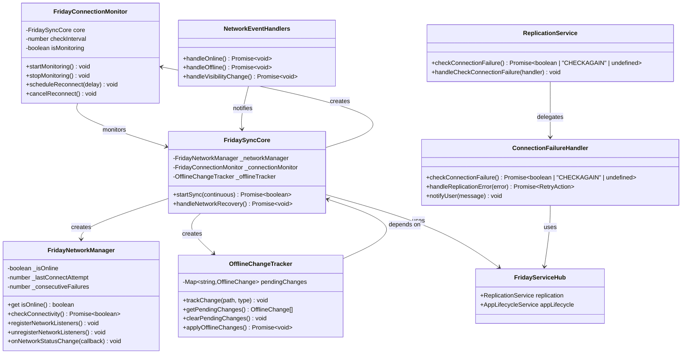

# Network Error Handling Implementation - Implementation Context

## Implementation Prompt: Network Failure Recovery & Offline Support

### Requirements Anchoring
Implement robust network error handling for the Friday plugin by porting livesync's network management and failure recovery patterns.
This enables graceful handling of network failures (firewall blocking, server unavailable, timeout) with proper user feedback, automatic reconnection, and offline change tracking.
The goal is to provide a resilient sync experience even in challenging network environments like corporate firewalls.

### Business Model


### Solution
1. **Network State Management Strategy**:
   - Enhance `NetworkManager` beyond simple `navigator.onLine` check
   - Add actual connectivity testing (attempt CouchDB connection)
   - Track consecutive failures for exponential backoff
   - Distinguish between "network offline" and "server unreachable"

2. **Event-Driven Architecture** (matching livesync's `ModuleObsidianEvents`):
   - Register `window.online` and `window.offline` event listeners
   - Register `document.visibilitychange` for resume handling
   - Trigger appropriate sync actions on state changes
   - Implement proper cleanup on plugin unload

3. **Connection Failure Recovery** (simplified from livesync's `ModuleReplicator`):
   - Implement `checkConnectionFailure` hook in ReplicationService
   - Use Notice notifications instead of dialogs (no user decision needed)
   - Support "CHECKAGAIN" return value for automatic retry
   - Database reset detection via Salt mechanism (already implemented)

4. **Offline Change Tracking** (matching livesync's pattern):
   - Track local changes made while offline
   - Queue changes for sync when connection restored
   - Provide "Scan and apply offline changes" functionality
   - Integrate with HiddenFileSync for internal files

### Structure

#### Inheritance Relationships
1. `FridayNetworkManager` - Extends `NetworkManager` base class (already exists in core)
2. `FridayConnectionMonitor` - Standalone class for connection health monitoring
3. `NetworkEventHandlers` - Mixin/utility functions for DOM event handling
4. `ConnectionFailureHandler` - Service class for failure recovery logic
5. `OfflineChangeTracker` - Standalone class for offline change management

#### Dependencies
1. FridayNetworkManager depends on:
   - Browser's `navigator.onLine` API (basic check)
   - CouchDB test endpoint (actual connectivity check)
   - `FridaySyncCore.testConnection()` method
2. FridayConnectionMonitor depends on:
   - `FridaySyncCore` for sync operations
   - `FridayNetworkManager` for status checks
   - Timer APIs for scheduled reconnection
3. ConnectionFailureHandler depends on:
   - `FridaySyncCore` for replicator access
   - Logger for Notice notifications (no UI dialogs needed)
4. OfflineChangeTracker depends on:
   - `FridayStorageEventManager` for change detection
   - `kvDB` for persistent storage

#### Layered Architecture
```
┌─────────────────────────────────────────────────────────────────┐
│                    Event Layer (DOM Events)                      │
│  - window.online / window.offline                               │
│  - document.visibilitychange                                    │
│  - Focus/blur events                                            │
└─────────────────────────────────────────────────────────────────┘
                              │
                              ▼
┌─────────────────────────────────────────────────────────────────┐
│               Network Management Layer                           │
│  - FridayNetworkManager (status tracking)                       │
│  - FridayConnectionMonitor (health checks)                      │
│  - NetworkEventHandlers (event processing)                      │
└─────────────────────────────────────────────────────────────────┘
                              │
                              ▼
┌─────────────────────────────────────────────────────────────────┐
│                 Failure Recovery Layer                           │
│  - ConnectionFailureHandler (retry logic + Notice notifications)│
│  - OfflineChangeTracker (change queue)                          │
│  - Salt-based database reset detection (existing)               │
└─────────────────────────────────────────────────────────────────┘
                              │
                              ▼
┌─────────────────────────────────────────────────────────────────┐
│                   Core Sync Layer                                │
│  - FridaySyncCore (sync orchestration)                          │
│  - LiveSyncCouchDBReplicator (replication)                      │
│  - FridayServiceHub (service coordination)                      │
└─────────────────────────────────────────────────────────────────┘
```

### Tasks

#### Task 1: Enhance NetworkManager
1. **Responsibility**: Upgrade NetworkManager beyond basic `navigator.onLine`
2. **File**: `src/sync/core/managers/NetworkManager.ts`
3. **Changes**:
   ```typescript
   export abstract class NetworkManager {
       abstract get isOnline(): boolean;
       abstract checkActualConnectivity(): Promise<boolean>;
       abstract onStatusChange(callback: (online: boolean) => void): void;
   }

   export class NetworkManagerBrowser extends NetworkManager {
       private _statusCallbacks: ((online: boolean) => void)[] = [];
       private _lastKnownStatus: boolean = true;
       private _consecutiveFailures: number = 0;
       private _serverReachable: boolean | null = null;
       
       override get isOnline(): boolean {
           // Basic check - network interface is up
           return navigator.onLine;
       }
       
       /**
        * Check if we can actually reach the sync server
        * This detects firewall blocking that navigator.onLine misses
        */
       async checkActualConnectivity(): Promise<boolean> {
           if (!navigator.onLine) {
               this._serverReachable = false;
               return false;
           }
           // Actual server connectivity is checked by replicator
           return this._serverReachable ?? true;
       }
       
       setServerReachable(reachable: boolean): void {
           const wasReachable = this._serverReachable;
           this._serverReachable = reachable;
           
           if (reachable) {
               this._consecutiveFailures = 0;
           } else {
               this._consecutiveFailures++;
           }
           
           // Notify if status changed
           if (wasReachable !== reachable) {
               this._notifyStatusChange(reachable);
           }
       }
       
       get consecutiveFailures(): number {
           return this._consecutiveFailures;
       }
       
       onStatusChange(callback: (online: boolean) => void): void {
           this._statusCallbacks.push(callback);
       }
       
       private _notifyStatusChange(online: boolean): void {
           for (const cb of this._statusCallbacks) {
               try { cb(online); } catch (e) { console.error(e); }
           }
       }
   }
   ```
4. **Source Reference**: `livesync/src/modules/essentialObsidian/ModuleObsidianEvents.ts` lines 86-112

#### Task 2: Create Network Event Handlers Module
1. **Responsibility**: Register and handle browser network events
2. **File**: `src/sync/features/NetworkEvents/index.ts`
3. **New Module**:
   ```typescript
   import { Plugin } from "obsidian";
   import { Logger, LOG_LEVEL_INFO, LOG_LEVEL_NOTICE, LOG_LEVEL_VERBOSE } from "../../core/common/logger";
   import { scheduleTask } from "octagonal-wheels/concurrency/task";
   import { fireAndForget } from "octagonal-wheels/promises";
   import type { FridaySyncCore } from "../../FridaySyncCore";

   export class FridayNetworkEvents {
       private plugin: Plugin;
       private core: FridaySyncCore;
       private hasFocus: boolean = true;
       private isLastHidden: boolean = false;
       private boundHandlers: {
           online: () => void;
           offline: () => void;
           visibilityChange: () => void;
           focus: () => void;
           blur: () => void;
       } | null = null;

       constructor(plugin: Plugin, core: FridaySyncCore) {
           this.plugin = plugin;
           this.core = core;
       }

       /**
        * Register all network-related event listeners
        * Matching livesync's ModuleObsidianEvents.registerWatchEvents()
        */
       registerEvents(): void {
           this.boundHandlers = {
               online: this.watchOnline.bind(this),
               offline: this.watchOnline.bind(this),
               visibilityChange: this.watchWindowVisibility.bind(this),
               focus: () => this.setHasFocus(true),
               blur: () => this.setHasFocus(false),
           };

           // Register DOM events through Obsidian's event system for proper cleanup
           this.plugin.registerDomEvent(window, "online", this.boundHandlers.online);
           this.plugin.registerDomEvent(window, "offline", this.boundHandlers.offline);
           this.plugin.registerDomEvent(document, "visibilitychange", this.boundHandlers.visibilityChange);
           this.plugin.registerDomEvent(window, "focus", this.boundHandlers.focus);
           this.plugin.registerDomEvent(window, "blur", this.boundHandlers.blur);
           
           Logger("Network event listeners registered", LOG_LEVEL_VERBOSE);
       }

       private setHasFocus(hasFocus: boolean): void {
           this.hasFocus = hasFocus;
           this.watchWindowVisibility();
       }

       /**
        * Handle online/offline events
        * Source: livesync ModuleObsidianEvents.watchOnline()
        */
       private watchOnline(): void {
           scheduleTask("watch-online", 500, () => fireAndForget(() => this.watchOnlineAsync()));
       }

       private async watchOnlineAsync(): Promise<void> {
           const isOnline = navigator.onLine;
           Logger(`Network status changed: ${isOnline ? "online" : "offline"}`, LOG_LEVEL_INFO);
           
           if (isOnline) {
               // Network recovered - trigger reconnection
               await this.core.handleNetworkRecovery();
           } else {
               // Network lost - update status
               this.core.managers.networkManager.setServerReachable(false);
           }
       }

       /**
        * Handle visibility changes (tab switching, minimize)
        * Source: livesync ModuleObsidianEvents.watchWindowVisibility()
        */
       private watchWindowVisibility(): void {
           scheduleTask("watch-window-visibility", 100, () => 
               fireAndForget(() => this.watchWindowVisibilityAsync())
           );
       }

       private async watchWindowVisibilityAsync(): Promise<void> {
           const settings = this.core.getSettings();
           if (settings.suspendFileWatching) return;
           if (!settings.isConfigured) return;
           
           if (this.isLastHidden && !this.hasFocus) {
               // NO OP while non-focused after made hidden
               return;
           }

           const isHidden = document.hidden;
           if (this.isLastHidden === isHidden) {
               return;
           }
           this.isLastHidden = isHidden;

           if (isHidden) {
               // Window hidden - could suspend sync
               Logger("Window hidden, sync continues in background", LOG_LEVEL_VERBOSE);
           } else {
               // Window visible again
               if (!this.hasFocus) return;
               Logger("Window visible, checking for sync updates", LOG_LEVEL_VERBOSE);
               // Trigger a sync check on resume
               await this.core.handleNetworkRecovery();
           }
       }

       unload(): void {
           // Events are cleaned up automatically by Obsidian's registerDomEvent
           this.boundHandlers = null;
       }
   }
   ```
4. **Source Reference**: `livesync/src/modules/essentialObsidian/ModuleObsidianEvents.ts` lines 77-141

#### Task 3: Implement Connection Failure Handler
1. **Responsibility**: Handle connection failures with Notice notifications (no UI dialogs)
2. **File**: `src/sync/features/ConnectionFailure/index.ts`
3. **Design Decision**: 
   - **No UI dialogs needed** - Friday uses Salt-based database reset detection
   - Database reset is detected via `checkSaltConsistency()` (already implemented)
   - User recovery action: Settings page → "Fetch from Server"
   - Only one option available, so no dialog choice needed
4. **New Module**:
   ```typescript
   import { Logger, LOG_LEVEL_INFO, LOG_LEVEL_NOTICE, LOG_LEVEL_VERBOSE } from "../../core/common/logger";
   import { $msg } from "../../core/common/i18n";
   import type { FridaySyncCore } from "../../FridaySyncCore";

   export type ConnectionFailureResult = boolean | "CHECKAGAIN" | undefined;

   export class FridayConnectionFailureHandler {
       private core: FridaySyncCore;
       private _lastFailureNotified: number = 0;
       private _failureNotificationCooldown: number = 30000; // 30 seconds

       constructor(core: FridaySyncCore) {
           this.core = core;
       }

       /**
        * Check connection failure and determine action
        * 
        * NOTE: Unlike livesync which uses MILESTONE document for database reset detection,
        * Friday uses Salt consistency check. This is more suitable for our backend-controlled
        * database reset scenario where:
        * - Backend rebuilds database with same config but new salt
        * - Salt change is the only indicator of reset
        * - No MILESTONE document management needed
        */
       async checkConnectionFailure(): Promise<ConnectionFailureResult> {
           // Salt-based reset detection is handled in openOneShotReplication()
           // via checkSaltConsistency() - no additional check needed here
           
           // For network errors, just return false to allow auto-retry
           return false;
       }

       /**
        * Notify user about database reset (Notice only, no dialog)
        * User should go to Settings → "Fetch from Server" to recover
        */
       notifyDatabaseReset(): void {
           const now = Date.now();
           if (now - this._lastFailureNotified < this._failureNotificationCooldown) {
               return; // Avoid notification spam
           }
           this._lastFailureNotified = now;

           // Notice notification - user goes to Settings to take action
           Logger(
               $msg("fridaySync.saltChanged.message") || 
               "Remote database has been reset. Please use 'Fetch from Server' in Settings to re-sync.",
               LOG_LEVEL_NOTICE
           );
       }

       /**
        * Handle replication error with retry logic
        * @returns Action to take: 'retry', 'abort', or 'ignore'
        */
       async handleReplicationError(error: any, showNotice: boolean): Promise<'retry' | 'abort' | 'ignore'> {
           const errorMessage = error?.message || String(error);
           
           // Check for network-related errors
           if (this.isNetworkError(error)) {
               this.core.managers.networkManager.setServerReachable(false);
               
               if (showNotice) {
                   Logger(
                       $msg("fridaySync.error.networkUnavailable") ||
                       "Cannot connect to sync server. Will retry when network is available.",
                       LOG_LEVEL_NOTICE
                   );
               }
               return 'retry';
           }

           // Check for authentication errors
           if (this.isAuthError(error)) {
               Logger(
                   $msg("fridaySync.error.authFailed") ||
                   "Authentication failed. Please check your credentials in Settings.",
                   LOG_LEVEL_NOTICE
               );
               return 'abort';
           }

           // Check for timeout errors
           if (this.isTimeoutError(error)) {
               Logger("Connection timeout, will retry...", LOG_LEVEL_INFO);
               return 'retry';
           }

           // Unknown error
           Logger(`Sync error: ${errorMessage}`, LOG_LEVEL_VERBOSE);
           return 'ignore';
       }

       private isNetworkError(error: any): boolean {
           if (!error) return false;
           const message = error?.message?.toLowerCase() || '';
           return (
               error.name === 'TypeError' && message.includes('fetch') ||
               message.includes('network') ||
               message.includes('econnrefused') ||
               message.includes('enotfound') ||
               message.includes('etimedout') ||
               error.status === 0
           );
       }

       private isAuthError(error: any): boolean {
           return error?.status === 401 || error?.status === 403;
       }

       private isTimeoutError(error: any): boolean {
           if (!error) return false;
           const message = error?.message?.toLowerCase() || '';
           return (
               message.includes('timeout') ||
               error.name === 'TimeoutError' ||
               error.status === 408
           );
       }

       /**
        * Calculate retry delay with exponential backoff
        */
       getRetryDelay(): number {
           const failures = this.core.managers.networkManager.consecutiveFailures;
           const baseDelay = 5000; // 5 seconds
           const maxDelay = 300000; // 5 minutes
           const delay = Math.min(baseDelay * Math.pow(2, failures - 1), maxDelay);
           return delay;
       }
   }
   ```
5. **Source Reference**: Simplified from `livesync/src/modules/coreFeatures/ModuleResolveMismatchedTweaks.ts`
6. **Key Differences from Livesync**:
   | Aspect | Livesync | Friday |
   |--------|----------|--------|
   | Reset Detection | MILESTONE document | Salt consistency |
   | User Interaction | Dialog with choices | Notice → Settings page |
   | Recovery Options | Fetch/Unlock/Dismiss | Fetch only |
   | Config Mismatch | Dialog to choose | Not applicable (backend controlled) |

#### Task 4: Implement Connection Monitor
1. **Responsibility**: Monitor connection health and schedule reconnection
2. **File**: `src/sync/features/ConnectionMonitor/index.ts`
3. **New Module**:
   ```typescript
   import { Logger, LOG_LEVEL_INFO, LOG_LEVEL_NOTICE, LOG_LEVEL_VERBOSE } from "../../core/common/logger";
   import type { FridaySyncCore } from "../../FridaySyncCore";

   export class FridayConnectionMonitor {
       private core: FridaySyncCore;
       private reconnectTimer: ReturnType<typeof setTimeout> | null = null;
       private healthCheckTimer: ReturnType<typeof setInterval> | null = null;
       private isMonitoring: boolean = false;
       private healthCheckInterval: number = 60000; // 1 minute

       constructor(core: FridaySyncCore) {
           this.core = core;
       }

       /**
        * Start monitoring connection health
        */
       startMonitoring(): void {
           if (this.isMonitoring) return;
           this.isMonitoring = true;

           // Periodic health check
           this.healthCheckTimer = setInterval(() => {
               this.performHealthCheck();
           }, this.healthCheckInterval);

           Logger("Connection monitoring started", LOG_LEVEL_VERBOSE);
       }

       /**
        * Stop monitoring
        */
       stopMonitoring(): void {
           this.isMonitoring = false;
           this.cancelReconnect();
           
           if (this.healthCheckTimer) {
               clearInterval(this.healthCheckTimer);
               this.healthCheckTimer = null;
           }

           Logger("Connection monitoring stopped", LOG_LEVEL_VERBOSE);
       }

       /**
        * Perform a health check on the connection
        */
       private async performHealthCheck(): Promise<void> {
           if (!this.core.replicator) return;
           
           const status = this.core.replicationStat.value.syncStatus;
           
           // If we're supposed to be connected but status is problematic
           if (status === "ERRORED" || status === "CLOSED") {
               const networkOnline = navigator.onLine;
               if (networkOnline) {
                   Logger("Connection appears unhealthy, scheduling reconnect", LOG_LEVEL_VERBOSE);
                   this.scheduleReconnect(5000);
               }
           }
       }

       /**
        * Schedule a reconnection attempt
        */
       scheduleReconnect(delay: number): void {
           this.cancelReconnect();
           
           Logger(`Scheduling reconnect in ${delay}ms`, LOG_LEVEL_VERBOSE);
           
           this.reconnectTimer = setTimeout(async () => {
               this.reconnectTimer = null;
               await this.attemptReconnect();
           }, delay);
       }

       /**
        * Cancel any pending reconnection
        */
       cancelReconnect(): void {
           if (this.reconnectTimer) {
               clearTimeout(this.reconnectTimer);
               this.reconnectTimer = null;
           }
       }

       /**
        * Attempt to reconnect
        */
       private async attemptReconnect(): Promise<void> {
           if (!navigator.onLine) {
               Logger("Network offline, skipping reconnect attempt", LOG_LEVEL_VERBOSE);
               return;
           }

           Logger("Attempting to reconnect...", LOG_LEVEL_INFO);
           
           try {
               // Test connection first
               const testResult = await this.core.testConnection();
               
               if (testResult.success) {
                   this.core.managers.networkManager.setServerReachable(true);
                   
                   // Restart sync if it was running
                   const settings = this.core.getSettings();
                   if (settings.liveSync) {
                       await this.core.startSync(true);
                       Logger("Reconnected and sync restarted", LOG_LEVEL_NOTICE);
                   }
               } else {
                   this.core.managers.networkManager.setServerReachable(false);
                   
                   // Schedule another attempt with exponential backoff
                   const delay = this.calculateBackoffDelay();
                   Logger(`Reconnect failed, will retry in ${delay / 1000}s`, LOG_LEVEL_INFO);
                   this.scheduleReconnect(delay);
               }
           } catch (error) {
               this.core.managers.networkManager.setServerReachable(false);
               Logger(`Reconnect error: ${error}`, LOG_LEVEL_VERBOSE);
               
               const delay = this.calculateBackoffDelay();
               this.scheduleReconnect(delay);
           }
       }

       /**
        * Calculate backoff delay based on consecutive failures
        */
       private calculateBackoffDelay(): number {
           const failures = this.core.managers.networkManager.consecutiveFailures;
           const baseDelay = 10000; // 10 seconds
           const maxDelay = 300000; // 5 minutes
           return Math.min(baseDelay * Math.pow(1.5, failures), maxDelay);
       }
   }
   ```

#### Task 5: Implement Offline Change Tracker
1. **Responsibility**: Track changes made while offline for later sync
2. **File**: `src/sync/features/OfflineTracker/index.ts`
3. **New Module**:
   ```typescript
   import { Logger, LOG_LEVEL_INFO, LOG_LEVEL_NOTICE, LOG_LEVEL_VERBOSE } from "../../core/common/logger";
   import type { FilePath } from "../../core/common/types";
   import type { FridaySyncCore } from "../../FridaySyncCore";
   import type { KeyValueDatabase } from "../../core/interfaces/KeyValueDatabase";

   export interface OfflineChange {
       path: FilePath;
       type: "create" | "modify" | "delete";
       timestamp: number;
   }

   const OFFLINE_CHANGES_KEY = "friday-offline-changes";

   export class FridayOfflineTracker {
       private core: FridaySyncCore;
       private kvDB: KeyValueDatabase;
       private pendingChanges: Map<string, OfflineChange> = new Map();
       private isOffline: boolean = false;

       constructor(core: FridaySyncCore) {
           this.core = core;
           this.kvDB = core.kvDB;
       }

       /**
        * Initialize tracker and load persisted changes
        */
       async initialize(): Promise<void> {
           await this.loadPersistedChanges();
       }

       /**
        * Set offline status
        */
       setOffline(offline: boolean): void {
           const wasOffline = this.isOffline;
           this.isOffline = offline;
           
           if (wasOffline && !offline) {
               // Just came online - persist changes before sync
               this.persistChanges();
           }
       }

       /**
        * Track a file change that occurred while offline
        */
       trackChange(path: FilePath, type: "create" | "modify" | "delete"): void {
           if (!this.isOffline) return; // Only track when offline
           
           const change: OfflineChange = {
               path,
               type,
               timestamp: Date.now(),
           };
           
           this.pendingChanges.set(path, change);
           Logger(`Tracked offline change: ${type} ${path}`, LOG_LEVEL_VERBOSE);
           
           // Persist immediately for safety
           this.persistChanges();
       }

       /**
        * Get all pending offline changes
        */
       getPendingChanges(): OfflineChange[] {
           return Array.from(this.pendingChanges.values());
       }

       /**
        * Get count of pending changes
        */
       get pendingCount(): number {
           return this.pendingChanges.size;
       }

       /**
        * Clear all pending changes (after successful sync)
        */
       async clearPendingChanges(): Promise<void> {
           this.pendingChanges.clear();
           await this.kvDB.delete(OFFLINE_CHANGES_KEY);
           Logger("Offline changes cleared", LOG_LEVEL_VERBOSE);
       }

       /**
        * Apply offline changes after reconnection
        * Source: livesync CmdHiddenFileSync.applyOfflineChanges()
        */
       async applyOfflineChanges(showNotice: boolean = true): Promise<void> {
           const changes = this.getPendingChanges();
           if (changes.length === 0) {
               if (showNotice) {
                   Logger("No offline changes to apply", LOG_LEVEL_INFO);
               }
               return;
           }

           Logger(`Applying ${changes.length} offline changes...`, 
               showNotice ? LOG_LEVEL_NOTICE : LOG_LEVEL_INFO);

           let applied = 0;
           let errors = 0;

           for (const change of changes) {
               try {
                   await this.applyChange(change);
                   applied++;
               } catch (error) {
                   errors++;
                   Logger(`Failed to apply offline change for ${change.path}: ${error}`, LOG_LEVEL_VERBOSE);
               }
           }

           await this.clearPendingChanges();
           
           Logger(`Applied ${applied} offline changes (${errors} errors)`,
               showNotice ? LOG_LEVEL_NOTICE : LOG_LEVEL_INFO);
       }

       /**
        * Apply a single offline change
        */
       private async applyChange(change: OfflineChange): Promise<void> {
           const storageManager = this.core.storageEventManager;
           if (!storageManager) return;

           // Trigger the appropriate sync action
           // The storage event manager will handle the actual database operation
           switch (change.type) {
               case "create":
               case "modify":
                   await storageManager.processFileEventDirect({
                       type: "CHANGED",
                       path: change.path,
                   });
                   break;
               case "delete":
                   await storageManager.processFileEventDirect({
                       type: "DELETED",
                       path: change.path,
                   });
                   break;
           }
       }

       /**
        * Persist changes to kvDB for crash recovery
        */
       private async persistChanges(): Promise<void> {
           const changes = Array.from(this.pendingChanges.entries());
           await this.kvDB.set(OFFLINE_CHANGES_KEY, changes);
       }

       /**
        * Load persisted changes from kvDB
        */
       private async loadPersistedChanges(): Promise<void> {
           const stored = await this.kvDB.get<[string, OfflineChange][]>(OFFLINE_CHANGES_KEY);
           if (stored) {
               this.pendingChanges = new Map(stored);
               Logger(`Loaded ${this.pendingChanges.size} persisted offline changes`, LOG_LEVEL_VERBOSE);
           }
       }
   }
   ```
4. **Source Reference**: `livesync/src/features/HiddenFileSync/CmdHiddenFileSync.ts` lines 1000-1087

#### Task 6: Update FridaySyncCore Integration
1. **Responsibility**: Integrate network handling into core sync
2. **File**: `src/sync/FridaySyncCore.ts`
3. **Changes**:
   ```typescript
   // Add imports
   import { FridayNetworkEvents } from "./features/NetworkEvents";
   import { FridayConnectionMonitor } from "./features/ConnectionMonitor";
   import { FridayConnectionFailureHandler } from "./features/ConnectionFailure";
   import { FridayOfflineTracker } from "./features/OfflineTracker";

   export class FridaySyncCore implements LiveSyncLocalDBEnv, LiveSyncCouchDBReplicatorEnv {
       // Add new properties
       private _networkEvents: FridayNetworkEvents | null = null;
       private _connectionMonitor: FridayConnectionMonitor | null = null;
       private _connectionFailureHandler: FridayConnectionFailureHandler | null = null;
       private _offlineTracker: FridayOfflineTracker | null = null;

       async initialize(config: SyncConfig): Promise<boolean> {
           // ... existing initialization code ...

           // Initialize network handling modules
           this._networkEvents = new FridayNetworkEvents(this.plugin, this);
           this._connectionMonitor = new FridayConnectionMonitor(this);
           this._connectionFailureHandler = new FridayConnectionFailureHandler(this);
           this._offlineTracker = new FridayOfflineTracker(this);
           
           await this._offlineTracker.initialize();
           
           // Register network event listeners
           this._networkEvents.registerEvents();
           
           // Start connection monitoring
           this._connectionMonitor.startMonitoring();

           // ... rest of initialization ...
       }

       /**
        * Handle network recovery - called when network comes back online
        */
       async handleNetworkRecovery(): Promise<void> {
           Logger("Network recovery detected", LOG_LEVEL_INFO);
           
           // Update network status
           this._managers?.networkManager.setServerReachable(true);
           
           // Apply any offline changes first
           if (this._offlineTracker && this._offlineTracker.pendingCount > 0) {
               await this._offlineTracker.applyOfflineChanges(true);
           }
           
           // Restart sync if configured
           if (this._settings.liveSync && this._replicator) {
               const status = this.replicationStat.value.syncStatus;
               if (status === "CLOSED" || status === "ERRORED" || status === "NOT_CONNECTED") {
                   Logger("Restarting sync after network recovery", LOG_LEVEL_INFO);
                   await this.startSync(true);
               }
           }
       }

       /**
        * Enhanced startSync with better error handling
        */
       async startSync(continuous: boolean = true): Promise<boolean> {
           // Check network first
           if (!navigator.onLine) {
               Logger("Network offline, sync deferred", LOG_LEVEL_INFO);
               this.setStatus("NOT_CONNECTED", "Network offline");
               return false;
           }

           if (!this._replicator) {
               this.setStatus("ERRORED", "Replicator not initialized");
               return false;
           }

           try {
               this.setStatus("STARTED", "Starting synchronization...");
               
               const result = await this._replicator.openReplication(
                   this._settings,
                   continuous,
                   false, // showResult: false for LiveSync mode
                   false  // ignoreCleanLock
               );

               // Check if connection actually succeeded
               if (!result) {
                   // Connection failed
                   this._managers?.networkManager.setServerReachable(false);
                   
                   // Check what kind of failure
                   const failureResult = await this._connectionFailureHandler?.checkConnectionFailure();
                   
                   if (failureResult === "CHECKAGAIN") {
                       // Schedule a retry
                       this._connectionMonitor?.scheduleReconnect(5000);
                   }
                   
                   const issues = this.getSyncIssues();
                   if (issues.needsFetch) {
                       Logger(issues.message, LOG_LEVEL_NOTICE);
                       this.setStatus("ERRORED", "Database reset detected");
                   } else {
                       // Network/server issue - will auto-retry
                       this.setStatus("NOT_CONNECTED", "Connection failed, will retry");
                       Logger("Sync connection failed, will retry when available", LOG_LEVEL_INFO);
                   }
                   
                   return false;
               }

               // Connection succeeded
               this._managers?.networkManager.setServerReachable(true);
               
               // Start file watcher after delay (existing logic)
               if (this._storageEventManager) {
                   const WATCH_DELAY_MS = 1500;
                   setTimeout(() => {
                       if (this._storageEventManager) {
                           this._storageEventManager.beginWatch();
                           Logger("File watcher started", LOG_LEVEL_INFO);
                       }
                   }, WATCH_DELAY_MS);
               }
               
               return true;
           } catch (error) {
               console.error("Sync failed:", error);
               this._managers?.networkManager.setServerReachable(false);
               
               // Handle the error
               const action = await this._connectionFailureHandler?.handleReplicationError(error, true);
               
               if (action === 'retry') {
                   const delay = this._connectionFailureHandler?.getRetryDelay() || 10000;
                   this._connectionMonitor?.scheduleReconnect(delay);
                   this.setStatus("NOT_CONNECTED", "Connection failed, will retry");
               } else {
                   this.setStatus("ERRORED", "Sync failed");
               }
               
               return false;
           }
       }

       async close(): Promise<void> {
           // Stop connection monitoring
           this._connectionMonitor?.stopMonitoring();
           
           // Unload network events
           this._networkEvents?.unload();
           
           // ... existing close logic ...
       }
   }
   ```

#### Task 7: Update FridayServiceHub with Connection Failure Hook
1. **Responsibility**: Add checkConnectionFailure to replication service
2. **File**: `src/sync/FridayServiceHub.ts`
3. **Changes**:
   ```typescript
   // In FridayReplicationService class:
   
   /**
    * Check connection failure hook
    * Called after replication failure to determine action
    * Source: livesync ModuleResolvingMismatchedTweaks
    */
   async checkConnectionFailure(): Promise<boolean | "CHECKAGAIN" | undefined> {
       // Call registered handlers
       const result = await this._handleCheckConnectionFailure();
       return result;
   }

   // Add handler registration
   [this.checkConnectionFailure, this.handleCheckConnectionFailure] =
       this._first<typeof this.checkConnectionFailure>("connectionHasFailure");
   ```

#### Task 8: Add i18n Messages
1. **Responsibility**: Add internationalized messages for network errors
2. **File**: `src/sync/core/common/messagesJson/en.json` (and other locales)
3. **New Messages**:
   ```json
   {
       "fridaySync.error.networkUnavailable": "Cannot connect to sync server. Will retry when network is available.",
       "fridaySync.error.databaseReset": "Remote database has been reset. Use 'Fetch from Server' to re-sync.",
       "fridaySync.error.authFailed": "Authentication failed. Please check your credentials.",
       "fridaySync.error.timeout": "Connection timeout. Will retry...",
       "fridaySync.network.offline": "Network offline - changes will sync when connection is restored",
       "fridaySync.network.reconnecting": "Reconnecting to sync server...",
       "fridaySync.network.reconnected": "Reconnected and sync restarted",
       "fridaySync.offline.changesTracked": "${count} changes tracked while offline",
       "fridaySync.offline.applyingChanges": "Applying ${count} offline changes..."
   }
   ```

#### Task 9: Update FridayStorageEventManager for Offline Tracking
1. **Responsibility**: Track changes when offline
2. **File**: `src/sync/FridayStorageEventManager.ts`
3. **Changes**:
   ```typescript
   // In processFileEvent method, add offline tracking:
   
   async processFileEvent(event: FileEvent): Promise<void> {
       // Check if we're offline
       const isOnline = this.core.managers?.networkManager?.isOnline ?? true;
       const serverReachable = // check server reachability
       
       if (!isOnline || !serverReachable) {
           // Track for later sync
           const offlineTracker = this.core.offlineTracker;
           if (offlineTracker) {
               const type = event.type === "DELETED" ? "delete" : 
                           event.type === "CREATED" ? "create" : "modify";
               offlineTracker.trackChange(event.path, type);
           }
       }
       
       // Continue with existing processing...
   }
   ```

### Common Tasks

1. **Logging Standards**:
   - Use `Logger()` from livesync core for consistent logging
   - Log levels: `LOG_LEVEL_INFO` (general info), `LOG_LEVEL_VERBOSE` (debug), `LOG_LEVEL_NOTICE` (user-visible)
   - Format: `Network status changed: ${online ? "online" : "offline"}`
   - Format: `Reconnect attempt ${attempt}: ${result}`

2. **Error Handling**:
   - Distinguish between network errors, auth errors, and server errors
   - Use exponential backoff for retries
   - Don't spam user with repeated failure notifications

3. **State Management**:
   - Keep `networkManager.isOnline` and `networkManager.serverReachable` in sync
   - Update `replicationStat.value.syncStatus` appropriately
   - Track `consecutiveFailures` for backoff calculation

4. **Event Cleanup**:
   - Use Obsidian's `registerDomEvent` for automatic cleanup
   - Clear timers in `close()` method
   - Unregister callbacks on unload

### Constraints

1. **Functional Constraints**:
   - Must detect both network offline (navigator.onLine) and server unreachable (firewall)
   - Must provide user feedback on connection failures
   - Must automatically reconnect when network recovers
   - Must preserve changes made while offline
   - Must not spam user with repeated notifications

2. **Performance Constraints**:
   - Use exponential backoff for reconnection attempts
   - Health check interval should be reasonable (1 minute minimum)
   - Don't block UI during reconnection attempts

3. **Compatibility Constraints**:
   - Must work with existing `LiveSyncCouchDBReplicator` architecture
   - Must integrate with existing `FridayServiceHub` patterns
   - Must not break existing sync functionality
   - Must work with livesync's `retry: true` option in PouchDB sync

4. **UX Constraints**:
   - Show clear status in UI when offline
   - Notify user when reconnection succeeds
   - Don't show repeated failure messages (cooldown)
   - Allow user to manually trigger reconnection

### File Structure

```
src/sync/
├── features/
│   ├── NetworkEvents/
│   │   └── index.ts              # FridayNetworkEvents class (~150 lines)
│   │                             # - DOM event registration
│   │                             # - online/offline handling
│   │                             # - visibility change handling
│   ├── ConnectionMonitor/
│   │   └── index.ts              # FridayConnectionMonitor class (~150 lines)
│   │                             # - Health check timer
│   │                             # - Reconnection scheduling
│   │                             # - Backoff calculation
│   ├── ConnectionFailure/
│   │   └── index.ts              # FridayConnectionFailureHandler class (~150 lines)
│   │                             # - Error classification
│   │                             # - Notice notifications (no dialogs)
│   │                             # - Retry decision
│   └── OfflineTracker/
│       └── index.ts              # FridayOfflineTracker class (~200 lines)
│                                 # - Change tracking
│                                 # - Persistence in kvDB
│                                 # - Offline change application
├── core/
│   └── managers/
│       └── NetworkManager.ts     # Updated: enhanced with server reachability
├── FridaySyncCore.ts             # Updated: integrate network modules
├── FridayStorageEventManager.ts  # Updated: offline change tracking
└── FridayServiceHub.ts           # Updated: checkConnectionFailure hook
```

### Source Code References

#### Livesync Original Source
| Component | Source File | Lines |
|-----------|-------------|-------|
| Network Events | `livesync/src/modules/essentialObsidian/ModuleObsidianEvents.ts` | 77-141 |
| Connection Check | `livesync/src/modules/core/ModuleReplicator.ts` | 113-118, 216-218 |
| Failure Handler | `livesync/src/modules/coreFeatures/ModuleResolveMismatchedTweaks.ts` | 19-27, 287-293 |
| Offline Changes | `livesync/src/features/HiddenFileSync/CmdHiddenFileSync.ts` | 1000-1087 |
| Replication Retry | `livesync/src/modules/core/ModuleReplicator.ts` | 311-325 |
| Network Manager Check | `livesync/src/modules/core/ModuleReplicator.ts` | 113-118 |

#### Friday Implementation
| Component | File | Key Methods |
|-----------|------|-------------|
| Network Events | `src/sync/features/NetworkEvents/index.ts` | registerEvents(), watchOnline() |
| Connection Monitor | `src/sync/features/ConnectionMonitor/index.ts` | scheduleReconnect(), attemptReconnect() |
| Failure Handler | `src/sync/features/ConnectionFailure/index.ts` | handleReplicationError(), notifyDatabaseReset() |
| Salt Detection | `src/sync/core/replication/LiveSyncAbstractReplicator.ts` | checkSaltConsistency(), clearStoredSalt(), updateStoredSalt() |
| Offline Tracker | `src/sync/features/OfflineTracker/index.ts` | trackChange(), applyOfflineChanges() |
| Core Integration | `src/sync/FridaySyncCore.ts` | handleNetworkRecovery(), startSync() |

### Implementation Priority

1. **Phase 1 - Critical** (Network Event Handling):
   - Task 2: Network Event Handlers
   - Task 6: FridaySyncCore Integration (partial - handleNetworkRecovery)

2. **Phase 2 - Important** (Connection Recovery):
   - Task 1: Enhanced NetworkManager
   - Task 3: Connection Failure Handler
   - Task 4: Connection Monitor

3. **Phase 3 - Enhancement** (Offline Support):
   - Task 5: Offline Change Tracker
   - Task 9: StorageEventManager Update

4. **Phase 4 - Polish** (User Experience):
   - Task 7: ServiceHub Hook
   - Task 8: i18n Messages

### Design Decisions

#### Why No UI Dialogs for Database Reset?

**Livesync's Approach**:
- Uses MILESTONE document to track accepted devices
- When database is reset, shows dialog with options: Fetch / Unlock / Dismiss
- Requires user to choose between multiple recovery options

**Friday's Approach** (Simplified):
- Uses Salt consistency check for database reset detection
- Backend-controlled database reset (not client-initiated)
- Only one recovery option: "Fetch from Server"
- No dialog needed - Notice notification + Settings page action

**Rationale**:
1. **Single Recovery Path**: When database is reset by backend, user only needs to "Fetch from Server"
2. **No Unlock Needed**: Friday doesn't use MILESTONE locking mechanism
3. **No Config Mismatch**: Backend ensures config consistency during rebuild
4. **Simpler UX**: Notice → Settings page is clearer than modal dialogs

```
┌─────────────────────────────────────────────────────────────────┐
│                    Friday Recovery Flow                          │
├─────────────────────────────────────────────────────────────────┤
│                                                                  │
│   Salt Change Detected                                          │
│         │                                                        │
│         ▼                                                        │
│   ┌─────────────────────────────────────────┐                   │
│   │ Notice: "Database reset detected.       │                   │
│   │ Please use 'Fetch from Server' to sync" │                   │
│   └─────────────────────────────────────────┘                   │
│         │                                                        │
│         ▼                                                        │
│   User opens Settings → Clicks "Fetch from Server"              │
│         │                                                        │
│         ▼                                                        │
│   clearStoredSalt() → replicateAllFromServer()                  │
│         │                                                        │
│         ▼                                                        │
│   updateStoredSalt() → Sync restored ✓                          │
│                                                                  │
└─────────────────────────────────────────────────────────────────┘
```

#### Existing Salt-Based Reset Detection

Friday already has robust Salt-based detection in `LiveSyncAbstractReplicator.ts`:

```typescript
// checkSaltConsistency() - detects when remote salt differs from stored
// clearStoredSalt() - called before "Fetch from Server"
// updateStoredSalt() - called after successful fetch
```

This mechanism is more suitable for Friday's backend-controlled scenario than livesync's MILESTONE-based approach.

