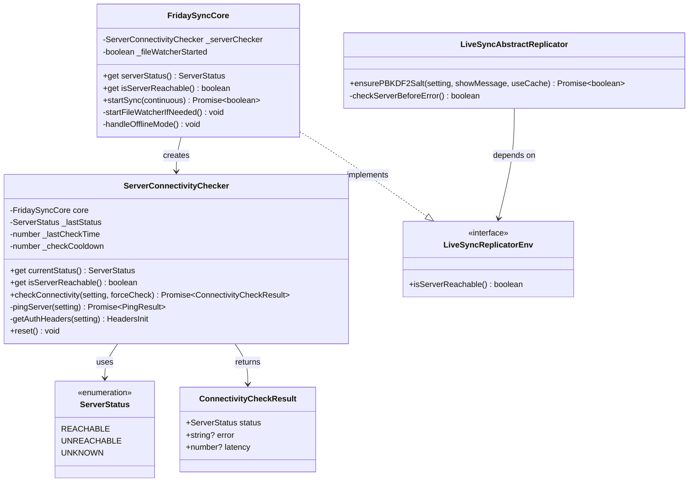

# Server Connectivity Check Implementation - Implementation Context

## Implementation Prompt: Server Status Pre-Check & Offline Mode Support

### Requirements Anchoring
Implement a server connectivity pre-check mechanism for the Friday plugin that runs before any synchronization operations.
This enables accurate error attribution (distinguishing "server unreachable" from "database reset" or "PBKDF2 error"), proper offline mode support, and prevents misleading error messages to users.
The goal is to provide a resilient sync experience where:
1. Server connectivity is verified first
2. Local file changes are always saved (even when offline)
3. Error messages accurately reflect the actual problem
4. Automatic reconnection is scheduled when server is unreachable

### Business Model


### Solution
1. **Server Connectivity Pre-Check Strategy**:
   - Create `ServerConnectivityChecker` module for lightweight server ping
   - Run connectivity check BEFORE any sync operations (ensurePBKDF2Salt, etc.)
   - Cache check results with cooldown to avoid excessive requests
   - Distinguish between "browser offline" and "server unreachable"

2. **Offline Mode Architecture**:
   - Start file watcher regardless of server connectivity
   - Local file changes always saved to PouchDB
   - Track offline status for later sync
   - Schedule automatic reconnection attempts

3. **Error Attribution Logic**:
   - If server unreachable: Skip PBKDF2/Salt checks, don't show misleading errors
   - If server reachable but PBKDF2 fails: Real encryption issue
   - If server reachable and PBKDF2 ok but salt mismatch: Real database reset

4. **State Propagation**:
   - `isServerReachable` available to all components via environment interface
   - Components check server status before attributing errors
   - Clear separation between "network issue" and "sync issue"

### Structure

#### Inheritance Relationships
1. `ServerConnectivityChecker` - Standalone class for server connectivity checking
2. `ServerStatus` - Enum for server status states
3. `ConnectivityCheckResult` - Interface for check results
4. `LiveSyncReplicatorEnv` - Extended interface with `isServerReachable`

#### Dependencies
1. ServerConnectivityChecker depends on:
   - `FridaySyncCore` for settings access
   - Browser's `fetch` API for ping requests
   - `navigator.onLine` for basic network check
2. FridaySyncCore depends on:
   - `ServerConnectivityChecker` for pre-check
   - `ConnectionMonitor` for reconnection scheduling
   - `OfflineTracker` for offline change tracking
3. LiveSyncAbstractReplicator depends on:
   - `LiveSyncReplicatorEnv.isServerReachable()` for error attribution

#### Layered Architecture
```
┌─────────────────────────────────────────────────────────────────┐
│                     Entry Point Layer                            │
│  - FridaySyncCore.startSync()                                   │
│  - Single entry point for all sync operations                   │
└─────────────────────────────────────────────────────────────────┘
                              │
                              ▼
┌─────────────────────────────────────────────────────────────────┐
│              Server Connectivity Layer (NEW)                     │
│  - ServerConnectivityChecker.checkConnectivity()                │
│  - Lightweight ping before any sync operations                  │
│  - Sets serverReachable status for downstream components        │
└─────────────────────────────────────────────────────────────────┘
                              │
              ┌───────────────┴───────────────┐
              │                               │
        Server Reachable              Server Unreachable
              │                               │
              ▼                               ▼
┌──────────────────────────┐    ┌──────────────────────────┐
│   Normal Sync Flow       │    │   Offline Mode           │
│  - ensurePBKDF2Salt()    │    │  - startFileWatcher()    │
│  - checkSaltConsistency()│    │  - offlineTracker.on()   │
│  - openReplication()     │    │  - scheduleReconnect()   │
└──────────────────────────┘    └──────────────────────────┘
```

### Tasks

#### Task 1: Create ServerConnectivityChecker Module
1. **Responsibility**: Lightweight server connectivity checking
2. **File**: `src/sync/features/ServerConnectivity/index.ts`
3. **New Module**:
   ```typescript
   import { Logger, LOG_LEVEL_INFO, LOG_LEVEL_VERBOSE } from "../../core/common/logger";
   import type { RemoteDBSettings } from "../../core/common/types";

   export type ServerStatus = "REACHABLE" | "UNREACHABLE" | "UNKNOWN";

   export interface ConnectivityCheckResult {
       status: ServerStatus;
       error?: string;
       latency?: number;
   }

   export class ServerConnectivityChecker {
       private _lastCheckTime: number = 0;
       private _lastStatus: ServerStatus = "UNKNOWN";
       private _checkCooldown: number = 5000; // 5 seconds

       /**
        * Current server status based on last check
        */
       get currentStatus(): ServerStatus {
           return this._lastStatus;
       }

       /**
        * Whether server is reachable
        */
       get isServerReachable(): boolean {
           return this._lastStatus === "REACHABLE";
       }

       /**
        * Check server connectivity
        * This is a lightweight check that only verifies server reachability
        */
       async checkConnectivity(
           setting: RemoteDBSettings,
           forceCheck: boolean = false
       ): Promise<ConnectivityCheckResult> {
           const now = Date.now();
           
           // Check cooldown
           if (!forceCheck && now - this._lastCheckTime < this._checkCooldown) {
               return { status: this._lastStatus };
           }

           // Check browser network status first
           if (!navigator.onLine) {
               this._lastStatus = "UNREACHABLE";
               this._lastCheckTime = now;
               return { status: "UNREACHABLE", error: "Browser is offline" };
           }

           const startTime = Date.now();

           try {
               const result = await this.pingServer(setting);

               if (result.ok) {
                   this._lastStatus = "REACHABLE";
                   this._lastCheckTime = now;
                   const latency = Date.now() - startTime;
                   Logger(`Server connectivity check passed (${latency}ms)`, LOG_LEVEL_VERBOSE);
                   return { status: "REACHABLE", latency };
               } else {
                   this._lastStatus = "UNREACHABLE";
                   this._lastCheckTime = now;
                   Logger(`Server connectivity check failed: ${result.error}`, LOG_LEVEL_INFO);
                   return { status: "UNREACHABLE", error: result.error };
               }
           } catch (ex: any) {
               this._lastStatus = "UNREACHABLE";
               this._lastCheckTime = now;
               const error = ex?.message || String(ex);
               Logger(`Server connectivity check error: ${error}`, LOG_LEVEL_VERBOSE);
               return { status: "UNREACHABLE", error };
           }
       }

       /**
        * Lightweight ping to server
        */
       private async pingServer(
           setting: RemoteDBSettings
       ): Promise<{ ok: boolean; error?: string }> {
           try {
               const uri = setting.couchDB_URI;
               const controller = new AbortController();
               const timeoutId = setTimeout(() => controller.abort(), 10000); // 10s timeout

               const response = await fetch(uri, {
                   method: "GET",
                   signal: controller.signal,
                   headers: this.getAuthHeaders(setting),
               });

               clearTimeout(timeoutId);

               // Server is reachable if we get any response (even auth errors)
               if (response.ok || response.status === 401 || response.status === 403) {
                   return { ok: true };
               } else {
                   return { ok: false, error: `HTTP ${response.status}` };
               }
           } catch (ex: any) {
               if (ex.name === "AbortError") {
                   return { ok: false, error: "Connection timeout" };
               }
               return { ok: false, error: ex.message || "Connection failed" };
           }
       }

       private getAuthHeaders(setting: RemoteDBSettings): HeadersInit {
           const headers: HeadersInit = {};
           if (setting.couchDB_USER && setting.couchDB_PASSWORD) {
               const auth = btoa(`${setting.couchDB_USER}:${setting.couchDB_PASSWORD}`);
               headers["Authorization"] = `Basic ${auth}`;
           }
           return headers;
       }

       /**
        * Reset status
        */
       reset(): void {
           this._lastStatus = "UNKNOWN";
           this._lastCheckTime = 0;
       }
   }
   ```

#### Task 2: Extend LiveSyncReplicatorEnv Interface
1. **Responsibility**: Add `isServerReachable` to environment interface
2. **File**: `src/sync/core/replication/LiveSyncAbstractReplicator.ts`
3. **Changes**:
   ```typescript
   export interface LiveSyncReplicatorEnv {
       // ... existing interface members ...

       /**
        * Check if server is reachable (provided by FridaySyncCore)
        * Used by replicator to determine error attribution
        */
       isServerReachable?: () => boolean;
   }
   ```

#### Task 3: Update FridaySyncCore - Integrate Server Connectivity Check
1. **Responsibility**: Add server pre-check and offline mode support
2. **File**: `src/sync/FridaySyncCore.ts`
3. **Changes**:
   ```typescript
   // Add import
   import { ServerConnectivityChecker, type ServerStatus } from "./features/ServerConnectivity";

   export class FridaySyncCore implements LiveSyncLocalDBEnv, LiveSyncCouchDBReplicatorEnv {
       // Add new properties
       private _serverChecker: ServerConnectivityChecker | null = null;
       private _fileWatcherStarted: boolean = false;

       // Add getters
       get serverStatus(): ServerStatus {
           return this._serverChecker?.currentStatus ?? "UNKNOWN";
       }

       get isServerReachable(): boolean {
           return this._serverChecker?.isServerReachable ?? false;
       }

       async initialize(config: SyncConfig): Promise<boolean> {
           // ... existing initialization ...

           // Initialize server connectivity checker
           this._serverChecker = new ServerConnectivityChecker();

           // ... rest of initialization ...
       }

       /**
        * Improved startSync with server pre-check
        */
       async startSync(continuous: boolean = true): Promise<boolean> {
           if (!this._replicator) {
               this.setStatus("ERRORED", "Replicator not initialized");
               return false;
           }

           try {
               this.setStatus("STARTED", "Checking server connectivity...");

               // ========== Step 1: Server Connectivity Pre-Check ==========
               const connectivityResult = await this._serverChecker?.checkConnectivity(
                   this._settings,
                   true  // Force check
               );

               if (connectivityResult?.status !== "REACHABLE") {
                   // Server unreachable - enter offline mode
                   return this.handleOfflineMode(connectivityResult?.error);
               }

               // ========== Server Reachable - Continue Normal Flow ==========
               Logger("Server connectivity confirmed", LOG_LEVEL_VERBOSE);
               this._managers?.networkManager.setServerReachable(true);

               // Start file watcher (for both online and offline scenarios)
               this.startFileWatcherIfNeeded();

               // ========== Step 2-4: Original Sync Logic ==========
               if (continuous) {
                   // LiveSync mode
                   await this._replicator.openReplication(
                       this._settings,
                       true,   // keepAlive
                       false,  // showResult
                       false   // ignoreCleanLock
                   );

                   // Connection timeout safety net
                   this.setupConnectionTimeout();
               } else {
                   // OneShot mode
                   const result = await this._replicator.openReplication(
                       this._settings,
                       false,
                       false,
                       false
                   );

                   if (!result) {
                       return this.handleSyncFailure();
                   }
               }

               return true;
           } catch (error) {
               console.error("Sync failed:", error);
               return this.handleSyncError(error);
           }
       }

       /**
        * Handle offline mode when server is unreachable
        */
       private handleOfflineMode(errorMessage?: string): boolean {
           Logger(`Server unreachable: ${errorMessage || 'unknown'}`, LOG_LEVEL_INFO);

           this._managers?.networkManager.setServerReachable(false);
           this.setStatus("NOT_CONNECTED", "Server unreachable, offline mode");

           // Start file watcher for offline mode
           this.startFileWatcherIfNeeded();

           // Enable offline tracking
           if (this._offlineTracker) {
               this._offlineTracker.setOffline(true);
           }

           // Schedule reconnection
           this._connectionMonitor?.scheduleReconnect(10000);

           // Show user-friendly message
           Logger(
               $msg("fridaySync.error.cannotConnectServer") ||
               "Cannot connect to server. Changes will be saved locally.",
               LOG_LEVEL_NOTICE
           );

           return false;
       }

       /**
        * Start file watcher if not already started
        */
       private startFileWatcherIfNeeded(): void {
           if (this._storageEventManager && !this._fileWatcherStarted) {
               this._fileWatcherStarted = true;
               const WATCH_DELAY_MS = 1500;
               setTimeout(() => {
                   if (this._storageEventManager) {
                       this._storageEventManager.beginWatch();
                       Logger("File watcher started - local changes will be saved", LOG_LEVEL_INFO);
                   }
               }, WATCH_DELAY_MS);
           }
       }

       /**
        * Setup connection timeout safety net
        */
       private setupConnectionTimeout(): void {
           const CONNECTION_TIMEOUT_MS = 30000;
           setTimeout(() => {
               const status = this.replicationStat.value.syncStatus;
               if (status === "STARTED") {
                   Logger("Connection timeout - status stuck at STARTED", LOG_LEVEL_INFO);
                   this.setStatus("NOT_CONNECTED", "Connection timeout");
                   this._managers?.networkManager.setServerReachable(false);
                   this._connectionMonitor?.scheduleReconnect(10000);
               }
           }, CONNECTION_TIMEOUT_MS);
       }
   }
   ```

#### Task 4: Update ensurePBKDF2Salt - Check Server Status Before Error Attribution
1. **Responsibility**: Avoid misleading error messages when server is unreachable
2. **File**: `src/sync/core/replication/LiveSyncAbstractReplicator.ts`
3. **Changes**:
   ```typescript
   async ensurePBKDF2Salt(
       setting: RemoteDBSettings,
       showMessage: boolean = false,
       useCache: boolean = true
   ): Promise<boolean> {
       try {
           const hash = await this.getReplicationPBKDF2Salt(setting, !useCache);
           if (hash.length == 0) {
               throw new Error("PBKDF2 salt is empty");
           }
           Logger(`PBKDF2 salt verified`, LOG_LEVEL_VERBOSE);
           return true;
       } catch (ex) {
           // Check server status before attributing error
           const serverReachable = this.env.isServerReachable?.() ?? true;

           if (!serverReachable) {
               // Server is unreachable - this is a network issue, not PBKDF2 issue
               // Don't show misleading "PBKDF2 failed" message
               Logger("PBKDF2 salt fetch skipped - server unreachable", LOG_LEVEL_VERBOSE);
               return false;
           }

           // Server is reachable but PBKDF2 failed - this is a real problem
           const level = showMessage ? LOG_LEVEL_NOTICE : LOG_LEVEL_INFO;
           Logger("Failed to obtain PBKDF2 salt", level);
           Logger(ex, LOG_LEVEL_VERBOSE);
           return false;
       }
   }
   ```

#### Task 5: Update openOneShotReplication - Simplified Error Handling
1. **Responsibility**: Proper status setting based on server reachability
2. **File**: `src/sync/core/replication/couchdb/LiveSyncReplicator.ts`
3. **Changes**:
   ```typescript
   async openOneShotReplication(
       setting: RemoteDBSettings,
       showResult: boolean,
       retrying: boolean,
       syncMode: "sync" | "pullOnly" | "pushOnly",
       ignoreCleanLock = false
   ): Promise<boolean> {
       // Server status is checked in startSync
       // Failures here are real problems (not network issues)

       if ((await this.ensurePBKDF2Salt(setting, showResult, !retrying)) === false) {
           // Check if server is reachable
           const serverReachable = this.env.isServerReachable?.() ?? true;

           if (serverReachable) {
               // Server reachable but PBKDF2 failed - real error
               this.syncStatus = "ERRORED";
               this.updateInfo();
           }
           // If server unreachable, status is already set to NOT_CONNECTED in startSync
           return false;
       }

       // Salt consistency check
       if (!retrying) {
           const saltCheck = await this.checkSaltConsistency(setting);
           if (!saltCheck.ok) {
               // Server reachable, PBKDF2 ok, but salt mismatch
               // This is a REAL database reset
               Logger(saltCheck.message!, LOG_LEVEL_NOTICE);
               this.syncStatus = "ERRORED";
               this.updateInfo();
               return false;
           }
       }

       // ... continue with existing sync logic ...
   }
   ```

#### Task 6: Add i18n Messages
1. **Responsibility**: Add user-friendly messages for server connectivity
2. **File**: `src/sync/core/common/messagesJson/en.json`
3. **New Messages**:
   ```json
   {
       "fridaySync.error.cannotConnectServer": "Cannot connect to sync server. Your changes will be saved locally and synced when connection is restored.",
       "fridaySync.error.serverTimeout": "Connection to sync server timed out. Will retry automatically.",
       "fridaySync.status.offlineMode": "Offline mode - changes saved locally",
       "fridaySync.status.reconnecting": "Reconnecting to sync server..."
   }
   ```
4. **File**: `src/sync/core/common/messagesJson/zh.json`
5. **New Messages**:
   ```json
   {
       "fridaySync.error.cannotConnectServer": "无法连接同步服务器。您的修改将保存在本地，恢复连接后会自动同步。",
       "fridaySync.error.serverTimeout": "连接同步服务器超时。将自动重试。",
       "fridaySync.status.offlineMode": "离线模式 - 修改已保存到本地",
       "fridaySync.status.reconnecting": "正在重新连接同步服务器..."
   }
   ```

#### Task 7: Add isWatching Property to FridayStorageEventManager
1. **Responsibility**: Prevent duplicate file watcher startup
2. **File**: `src/sync/FridayStorageEventManager.ts`
3. **Changes**:
   ```typescript
   export class FridayStorageEventManager {
       private _isWatching = false;

       /**
        * Whether file watcher is currently active
        */
       get isWatching(): boolean {
           return this._isWatching;
       }

       beginWatch() {
           if (this._isWatching) {
               Logger("File watcher already running", LOG_LEVEL_VERBOSE);
               return;
           }
           this._isWatching = true;

           // ... existing beginWatch logic ...
       }

       stopWatch() {
           this._isWatching = false;
           // ... existing stopWatch logic ...
       }
   }
   ```

### Common Tasks

1. **Logging Standards**:
   - Use `Logger()` from livesync core for consistent logging
   - Log levels: `LOG_LEVEL_INFO` (user-visible), `LOG_LEVEL_VERBOSE` (debug), `LOG_LEVEL_NOTICE` (popup)
   - Format: `Server connectivity check: ${result}`
   - Format: `Offline mode enabled - local changes will be saved`

2. **Error Handling**:
   - Always check `isServerReachable` before attributing errors
   - Don't show misleading messages (e.g., "PBKDF2 failed" when server is down)
   - Use user-friendly messages from i18n

3. **State Management**:
   - `serverStatus`: REACHABLE | UNREACHABLE | UNKNOWN
   - `isServerReachable`: boolean helper
   - `_fileWatcherStarted`: prevent duplicate startup
   - Propagate server status to all components via environment interface

4. **Cooldown Handling**:
   - 5 second cooldown between connectivity checks
   - Force check option available for critical operations
   - Reset cooldown on network status change

### Constraints

1. **Functional Constraints**:
   - Server connectivity check must complete within 10 seconds
   - File watcher must start regardless of server connectivity
   - Local changes must always be saved to PouchDB
   - Error messages must accurately reflect the actual problem

2. **Performance Constraints**:
   - Connectivity check should be lightweight (simple ping)
   - Use cooldown to avoid excessive requests
   - Don't block UI during connectivity checks

3. **Compatibility Constraints**:
   - Must work with existing `LiveSyncCouchDBReplicator` architecture
   - Must integrate with existing `NetworkManager` patterns
   - Must not break existing sync functionality
   - Must work with existing offline tracking mechanism

4. **UX Constraints**:
   - Show clear status when server is unreachable
   - Don't show misleading "database reset" messages for network issues
   - Notify user that changes are being saved locally
   - Show reconnection progress

### File Structure

```
src/sync/
├── features/
│   ├── ServerConnectivity/
│   │   └── index.ts              # ServerConnectivityChecker class (~150 lines)
│   │                             # - checkConnectivity()
│   │                             # - pingServer()
│   │                             # - Status caching with cooldown
│   ├── NetworkEvents/
│   │   └── index.ts              # (existing)
│   ├── ConnectionMonitor/
│   │   └── index.ts              # (existing)
│   ├── ConnectionFailure/
│   │   └── index.ts              # (existing)
│   └── OfflineTracker/
│       └── index.ts              # (existing)
├── core/
│   └── replication/
│       ├── LiveSyncAbstractReplicator.ts  # Updated: isServerReachable in env
│       └── couchdb/
│           └── LiveSyncReplicator.ts      # Updated: check server status
├── FridaySyncCore.ts             # Updated: integrate server pre-check
├── FridayStorageEventManager.ts  # Updated: add isWatching property
└── FridayServiceHub.ts           # (no changes)
```

### Source Code References

#### Livesync Original Source
| Component | Source File | Lines |
|-----------|-------------|-------|
| Network Check | `livesync/src/modules/core/ModuleReplicator.ts` | 113-118 |
| Network Manager | `livesync/src/modules/essentialObsidian/ModuleObsidianEvents.ts` | 86-112 |
| Replication Start | `livesync/src/modules/core/ModuleReplicatorCouchDB.ts` | 28-32 |

#### Friday Implementation
| Component | File | Key Methods |
|-----------|------|-------------|
| Server Checker | `src/sync/features/ServerConnectivity/index.ts` | checkConnectivity(), pingServer() |
| Core Integration | `src/sync/FridaySyncCore.ts` | startSync(), handleOfflineMode(), startFileWatcherIfNeeded() |
| PBKDF2 Check | `src/sync/core/replication/LiveSyncAbstractReplicator.ts` | ensurePBKDF2Salt() |
| Replicator | `src/sync/core/replication/couchdb/LiveSyncReplicator.ts` | openOneShotReplication() |

### Implementation Priority

1. **Phase 1 - Critical** (Server Pre-Check):
   - Task 1: Create ServerConnectivityChecker module
   - Task 3: Update FridaySyncCore with pre-check

2. **Phase 2 - Important** (Error Attribution):
   - Task 2: Extend LiveSyncReplicatorEnv interface
   - Task 4: Update ensurePBKDF2Salt
   - Task 5: Update openOneShotReplication

3. **Phase 3 - Enhancement** (User Experience):
   - Task 6: Add i18n messages
   - Task 7: Add isWatching property

### Flow Diagram

```
startSync()
    │
    ├── 1️⃣ ServerConnectivityChecker.checkConnectivity()
    │       │
    │       ├── REACHABLE ✅ ─────────────────────────────────┐
    │       │                                                 │
    │       └── UNREACHABLE ❌                                │
    │               │                                         │
    │               ├── setStatus("NOT_CONNECTED")            │
    │               ├── startFileWatcherIfNeeded()            │
    │               ├── offlineTracker.setOffline(true)       │
    │               ├── scheduleReconnect(10000)              │
    │               └── return false                          │
    │                                                         │
    ├── 2️⃣ startFileWatcherIfNeeded() ◄──────────────────────┘
    │       └── File watcher starts (online OR offline)
    │
    ├── 3️⃣ openReplication()
    │       │
    │       └── ensurePBKDF2Salt()
    │               │
    │               ├── Check isServerReachable()
    │               │       │
    │               │       ├── false → Skip error message
    │               │       │           (network issue, not PBKDF2)
    │               │       │
    │               │       └── true → Real PBKDF2 error
    │               │                   └── ERRORED
    │               │
    │               └── checkSaltConsistency()
    │                       │
    │                       └── fail = Real database reset
    │
    └── 4️⃣ Sync complete or failed
```

### Expected Behavior Comparison

| Scenario | Current Behavior | After Implementation |
|----------|------------------|----------------------|
| CouchDB unreachable | ⚠️ ERRORED + "PBKDF2 failed" | ⏹️ NOT_CONNECTED + "Server unreachable" |
| File watcher | ❌ Not started on failure | ✅ Always started |
| User file changes | ❌ Not saved | ✅ Saved to local PouchDB |
| Reconnection | ❌ Manual restart needed | ✅ Auto-scheduled |
| Real DB reset | ⚠️ Mixed with network errors | ✅ Clearly identified |
| Error messages | Misleading | Accurate |

