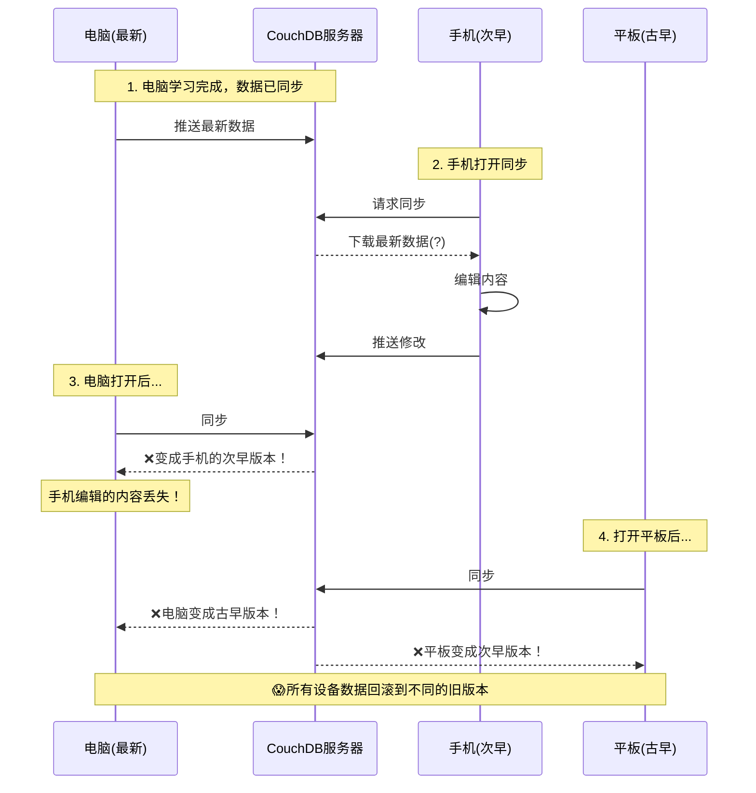

# 多设备同步数据回滚问题 - 深度分析报告

## 问题描述

用户反馈的现象：
1. **电脑**：最新版本（学习完成后）
2. **手机**：次早版本（学习前的版本）
3. **平板**：古早版本（很久没打开）

### 复现步骤与现象



## 核心问题分析

### 问题1：长期离线设备的 Checkpoint 陷阱

#### 源码证据

**ReplicatorShim.ts (lines 99-122):**

```typescript
// Checkpoint retrieval
// The checkpoint is a document that stores the last sequence number that has been replicated.
// We can track the changes efficiently by using the checkpoint.
const sourceCheckpointID = `_local/replication-checkpoint-mark-${targetDBName}-${sourceDBName}`;
const sourceCheckpointData = await upsert<{ mark: string }>(sourceDB, sourceCheckpointID, (doc) => {
    const previousMark: string = doc.mark ?? new Date().getTime().toString();
    const mark = option.rewind ? new Date().getTime().toString() : previousMark;
    return {
        ...doc,
        mark: mark,
    };
});
```

**问题分析：**

1. **平板上的古老 Checkpoint：**
   - 平板很久没打开，本地 PouchDB 中存储的 checkpoint 是几个月前的
   - Checkpoint 记录的 `since` 序列号指向古老的 CouchDB update_seq
   - 当平板同步时，它会从这个古老的序列号开始拉取变更

2. **时间窗口问题：**
   ```
   时间线：
   T0: 平板最后一次同步 (update_seq = 100)
   T1: 电脑学习前的状态 (update_seq = 500)  <- 手机状态
   T2: 电脑学习后的状态 (update_seq = 1000) <- 电脑状态
   T3: 现在平板打开 (本地checkpoint still at seq=100)
   ```

3. **增量同步的陷阱：**
   - 平板请求从 seq=100 开始的所有变更
   - CouchDB 返回 seq=100 到 seq=1000 的所有文档修订
   - **关键问题**：如果中间有文档被删除又重新创建，revision tree 可能断裂

### 问题2：PouchDB Revision Tree 的冲突解决策略

#### CouchDB 的 MVCC 机制

**核心原理：**
- CouchDB 使用 revision tree 来追踪文档的所有历史版本
- 每个文档有唯一的 `_rev` (revision ID)，格式为 `N-hash`
  - N = revision 序号
  - hash = 内容哈希

**bulkDocs with new_edits: false 的行为：**

```typescript
// ReplicatorShim.ts line 185
await targetDB.bulkDocs(fetchedMissingDocs, { new_edits: false });
// new_edits = false: means that we aimed to write the docs as they are, 
// even if they are conflicted.
```

**这意味着：**
1. 文档会被原样写入，保留其 `_rev`
2. 不会自动解决冲突，而是创建冲突分支
3. PouchDB 会保留多个冲突的 revision

### 问题3：冲突解决策略的致命缺陷

#### 当前的冲突解决逻辑

**HiddenFileSync - resolveByNewerEntry (lines 1178-1218):**

```typescript
private async resolveByNewerEntry(
    id: DocumentID,
    path: FilePathWithPrefix,
    currentDoc: MetaEntry,
    currentRev: string,
    conflictedRev: string
): Promise<void> {
    // Get the conflicted document
    const conflictedDoc = await localDB.getRaw<MetaEntry>(id, { rev: conflictedRev });
    
    // Compare mtime to determine which is newer
    const mtimeCurrent = getComparingMTime(currentDoc, true);
    const mtimeConflicted = getComparingMTime(conflictedDoc, true);
    
    // Delete the older revision
    const deleteRev = mtimeCurrent < mtimeConflicted ? currentRev : conflictedRev;
    await localDB.removeRevision(id, deleteRev);
}
```

**FridayServiceHub - defaultProcessSynchroniseResult (lines 417-428):**

```typescript
// 1. Check mtime freshness (2 second resolution)
const localMtime = existingFile.stat.mtime;
const remoteMtime = fullEntry.mtime || 0;

const mtimeComparison = compareMtime(localMtime, remoteMtime);

if (mtimeComparison !== "EVEN") {
    // Mtime is significantly different
    shouldWrite = true;
}
```

**致命问题：**

1. **mtime 只有 2 秒精度：**
   ```typescript
   // FridayStorageEventManager.ts lines 52-65
   const MTIME_RESOLUTION = 2000; // 2 seconds
   
   export function compareMtime(baseMTime: number, targetMTime: number) {
       const truncatedBaseMTime = Math.floor(baseMTime / MTIME_RESOLUTION) * MTIME_RESOLUTION;
       const truncatedTargetMTime = Math.floor(targetMTime / MTIME_RESOLUTION) * MTIME_RESOLUTION;
       if (truncatedBaseMTime === truncatedTargetMTime) return "EVEN";
       if (truncatedBaseMTime > truncatedTargetMTime) return "BASE_IS_NEW";
       return "TARGET_IS_NEW";
   }
   ```

2. **问题场景：**
   - 旧设备上的文档 mtime 可能比新版本的 mtime 更新（因为它是基于本地时钟）
   - 如果旧设备在本地做了修改（哪怕是冲突解决），mtime 会更新
   - 冲突解决时会选择 mtime 更新的版本，**即使内容是旧的**

### 问题4：设备长期离线后的"时间差"问题

#### 场景重现

**手机长期未打开的情况：**

```typescript
// 手机上的状态：
localDB.info() => {
    update_seq: 500,  // 停留在学习前
    doc_count: 1000
}

// 服务器上的状态：
remoteDB.info() => {
    update_seq: 1000, // 学习后的状态
    doc_count: 1200
}
```

**同步流程：**

1. **手机拉取变更 (Pull)：**
   ```typescript
   // LiveSyncReplicator.ts - openContinuousReplication (line 1110)
   if (await this.openOneShotReplication(setting, showResult, false, "pullOnly")) {
       // ...
   }
   ```

2. **问题出现时机：**
   - 手机从 seq=500 拉取到 seq=1000 的所有变更
   - 如果手机的本地 PouchDB 中已经有一些"脏数据"（未同步的本地修改）
   - 这些脏数据的 revision 号可能与服务器冲突

3. **冲突产生：**
   ```
   服务器文档:  _id: "file1.md", _rev: "5-abc" (新内容)
   手机本地文档: _id: "file1.md", _rev: "3-xyz" (旧内容，但有未同步的修改)
   
   → PouchDB 检测到冲突
   → 两个 revision 都保留在 revision tree
   → 哪个成为"winning revision"？
   ```

#### PouchDB 的 Winning Revision 选择算法

**算法规则（从 PouchDB 源码）：**

```javascript
// PouchDB 内部算法
function winningRev(metadata) {
    // 1. 选择 revision number 最大的分支
    // 2. 如果 revision number 相同，按 revision hash 字典序排序
    // 3. deleted 的 revision 优先级低
    
    var winningRev;
    var winningRevPos;
    var len = metadata.rev_tree.length;
    
    for (var i = 0; i < len; i++) {
        var rev = metadata.rev_tree[i];
        var pos = rev.pos;
        var hash = rev.ids[0];
        
        if (!winningRev || pos > winningRevPos || 
            (pos === winningRevPos && hash > winningRev)) {
            winningRev = hash;
            winningRevPos = pos;
        }
    }
    
    return winningRevPos + '-' + winningRev;
}
```

**问题：**
- Revision number 大的不一定是内容新的
- 旧设备可能因为本地修改产生了更高的 revision number
- **导致旧内容被选为 winning revision**

### 问题5：手机"下载了最新版本"后为何还会回滚

#### 关键代码路径

**1. 初始同步 (Pull from Server):**

```typescript
// LiveSyncReplicator.ts - openOneShotReplication
async openOneShotReplication(
    setting: RemoteDBSettings,
    showResult: boolean,
    retrying: boolean,
    syncMode: "sync" | "pullOnly" | "pushOnly",
    ignoreCleanLock = false
): Promise<boolean> {
    // ...
    
    // Pull from server
    if (syncMode === "pullOnly" || syncMode === "sync") {
        await replicateShim(localDB, remoteDB, progressCallback, {
            rewind: false  // 不重置 checkpoint
        });
    }
}
```

**2. 问题：下载后本地状态不一致**

```typescript
// 场景：手机下载最新版本
// Step 1: Pull from server (拉取 seq=500 到 seq=1000)
remoteDocs.forEach(doc => {
    localDB.bulkDocs([doc], { new_edits: false });
    // 文档被写入，但可能创建冲突
});

// Step 2: 手机用户立即编辑文件
// 问题：编辑的是哪个 revision？
vault.modify(file) => {
    // Obsidian 读取的是哪个版本？
    // 如果有冲突，读取的是 winning revision
    // 但 winning revision 可能不是最新的！
}
```

**3. 冲突检测的时机问题：**

```typescript
// FridayServiceHub.ts - defaultProcessSynchroniseResult
private async defaultProcessSynchroniseResult(doc: MetaEntry): Promise<boolean> {
    // 同步结果到达后才处理
    // 但此时用户可能已经在编辑文件了！
    
    // Check if this is an internal file
    const isInternalFile = isInternalMetadata(doc._id);
    
    if (isInternalFile) {
        // 内部文件由 HiddenFileSync 处理
        await this.core.hiddenFileSync?.trackDatabaseFileModification(doc);
    } else {
        // 普通文件直接写入
        await this.core.entryManager.dbToStorage(doc.path, true);
    }
}
```

**4. 竞态条件：**

```
时间线：
T0: 手机开始同步 (状态: seq=500)
T1: 收到文档 "note.md" rev="5-abc" (最新版本)
T2: 写入本地 PouchDB (可能创建冲突)
T3: 用户打开 note.md 开始编辑
T4: 冲突解决器运行，选择了旧 revision 作为 winning
T5: 用户保存修改
T6: 基于旧内容的修改被推送到服务器
```

## 根本原因总结

### 1. **Checkpoint 机制的假设失效**
   - 设计假设：设备定期同步，checkpoint 保持更新
   - 实际情况：设备长期离线，checkpoint 严重过时
   - 后果：拉取海量历史变更，revision tree 复杂度爆炸

### 2. **Revision Tree 冲突解决的算法缺陷**
   - Winning revision 选择基于 revision number，不基于时间戳
   - 旧设备的本地修改可能产生更高的 revision number
   - 导致旧内容被选为 winning revision

### 3. **mtime 比较的精度和可靠性问题**
   - 2 秒精度不足以区分快速编辑
   - 依赖设备本地时钟，可能不同步
   - 旧设备的 mtime 可能比新内容还新

### 4. **缺少"数据库版本"检测机制**
   - 没有全局的"数据库代"标识
   - 无法检测设备是否"过于陈旧"
   - Salt 检查只能检测远程重置，不能检测本地过时

### 5. **同步与用户操作的竞态条件**
   - 文档下载和冲突解决是异步的
   - 用户可能在冲突解决前就开始编辑
   - 缺少"同步完成前锁定编辑"的机制

## 用户案例中的具体问题流程

### 场景1：手机同步后电脑回滚

```
1. 手机打开 (状态: seq=500, 学习前)
2. 手机拉取 seq=500~1000 的变更
   - 很多文档在 revision tree 中形成冲突
   - 手机的 PouchDB 中存在大量 _conflicts
3. 手机编辑 note.md
   - 读取的可能是 winning revision (假设是最新的)
   - 但本地还有冲突的旧 revision
4. 手机保存并推送
   - 推送时可能只推送了 meta entry，chunks 还在冲突中
5. 电脑打开同步
   - 拉取到手机推送的"新"revision
   - 但 chunks 指向的可能是旧的冲突 revision
   - **结果：meta 是新的，但 chunks 是旧的 → 文件内容回滚**
```

### 场景2：平板同步后所有设备回滚

```
1. 平板打开 (状态: seq=100, 古早版本)
2. 平板拉取 seq=100~1000 的海量变更
   - Revision tree 极其复杂
   - 大量文档产生多层冲突
3. 平板的冲突解决器运行
   - 因为平板本地有很多旧文档
   - 这些旧文档的 mtime 可能因为 ZIP 解压等操作被更新
   - **冲突解决器选择了 mtime 更新的旧版本**
4. 平板推送"解决"后的文档
   - 推送的 revision number 更高（因为经过冲突解决）
   - 但内容是旧的
5. 服务器接受平板推送的 revision
   - 因为 revision number 更高
   - 成为新的 winning revision
6. 其他设备同步
   - 拉取到平板推送的"高 revision number"文档
   - **所有设备回滚到古早版本**
```

## 解决方案建议

### 短期方案（紧急修复）

#### 1. 添加"设备过时"检测

```typescript
// 新增: DeviceObsoleteChecker.ts
export class DeviceObsoleteChecker {
    /**
     * 检测设备是否过于陈旧，需要 Fetch from Server
     */
    async checkIfDeviceObsolete(
        localDB: PouchDB.Database,
        remoteDB: PouchDB.Database
    ): Promise<{ obsolete: boolean; reason: string }> {
        const localInfo = await localDB.info();
        const remoteInfo = await remoteDB.info();
        
        const localSeq = Number(String(localInfo.update_seq).split('-')[0]);
        const remoteSeq = Number(String(remoteInfo.update_seq).split('-')[0]);
        
        // 如果本地落后超过 1000 个 sequence
        const seqGap = remoteSeq - localSeq;
        if (seqGap > 1000) {
            return {
                obsolete: true,
                reason: `Device is ${seqGap} sequences behind server. Please use 'Fetch from Server'.`
            };
        }
        
        // 检查本地是否有大量冲突
        const conflicts = await this.getConflictCount(localDB);
        if (conflicts > 50) {
            return {
                obsolete: true,
                reason: `Device has ${conflicts} conflicts. Please use 'Fetch from Server'.`
            };
        }
        
        return { obsolete: false, reason: "" };
    }
    
    private async getConflictCount(db: PouchDB.Database): Promise<number> {
        const result = await db.allDocs({
            include_docs: false,
            conflicts: true
        });
        
        return result.rows.filter(row => 
            row.value && 'conflicts' in row.value
        ).length;
    }
}
```

#### 2. 在 startSync 前检测设备状态

```typescript
// FridaySyncCore.ts - startSync 修改
async startSync(continuous: boolean = true, options?: SyncOptions): Promise<boolean> {
    if (!this._replicator) {
        this.setStatus("ERRORED", "Replicator not initialized");
        return false;
    }

    try {
        this.setStatus("STARTED", "Checking sync status...");

        // ========== 新增：设备过时检测 ==========
        const obsoleteChecker = new DeviceObsoleteChecker();
        const checkResult = await obsoleteChecker.checkIfDeviceObsolete(
            this._localDatabase.localDatabase,
            await this._replicator.getRemoteDB(this._settings)
        );
        
        if (checkResult.obsolete) {
            Logger(checkResult.reason, LOG_LEVEL_NOTICE);
            Logger(
                "Your device is significantly out of sync. Please use 'Fetch from Server' " +
                "in Settings → Friday Sync to safely update your vault.",
                LOG_LEVEL_NOTICE
            );
            this.setStatus("ERRORED", "Device obsolete - Fetch from Server required");
            return false;
        }

        // ========== 继续原有的同步流程 ==========
        // ...
    }
}
```

#### 3. 改进冲突解决策略

```typescript
// HiddenFileSync.ts - resolveByNewerEntry 修改
private async resolveByNewerEntry(
    id: DocumentID,
    path: FilePathWithPrefix,
    currentDoc: MetaEntry,
    currentRev: string,
    conflictedRev: string
): Promise<void> {
    const localDB = this.core.localDatabase;
    if (!localDB) return;
    
    try {
        const conflictedDoc = await localDB.getRaw<MetaEntry>(id, { rev: conflictedRev });
        
        // ========== 新增：多维度比较 ==========
        
        // 1. 比较 revision number (revision 代数)
        const currentRevNum = Number(currentRev.split('-')[0]);
        const conflictedRevNum = Number(conflictedRev.split('-')[0]);
        
        // 2. 比较 mtime
        const mtimeCurrent = getComparingMTime(currentDoc, true);
        const mtimeConflicted = getComparingMTime(conflictedDoc, true);
        
        // 3. 比较文档大小 (作为 tie-breaker)
        const sizeCurrent = currentDoc.size || 0;
        const sizeConflicted = conflictedDoc.size || 0;
        
        // ========== 决策逻辑 ==========
        let deleteRev: string;
        
        // 优先：如果 revision number 差距很大（>10代），信任 revision number
        if (Math.abs(currentRevNum - conflictedRevNum) > 10) {
            deleteRev = currentRevNum < conflictedRevNum ? currentRev : conflictedRev;
            Logger(
                `[HiddenFileSync] Conflict resolved by revision number: ` +
                `keeping ${deleteRev === currentRev ? 'conflicted' : 'current'} (rev diff: ${Math.abs(currentRevNum - conflictedRevNum)})`,
                LOG_LEVEL_INFO
            );
        }
        // 次优：比较 mtime（但要警惕）
        else if (Math.abs(mtimeCurrent - mtimeConflicted) > 60000) { // 超过1分钟差异
            deleteRev = mtimeCurrent < mtimeConflicted ? currentRev : conflictedRev;
            Logger(
                `[HiddenFileSync] Conflict resolved by mtime: ` +
                `keeping ${deleteRev === currentRev ? 'conflicted' : 'current'}`,
                LOG_LEVEL_INFO
            );
        }
        // 最后：如果以上都不明显，保留两个版本，让用户决定
        else {
            Logger(
                `[HiddenFileSync] Conflict cannot be auto-resolved: ${path}. ` +
                `Current: rev=${currentRevNum}, mtime=${mtimeCurrent}, size=${sizeCurrent}. ` +
                `Conflicted: rev=${conflictedRevNum}, mtime=${mtimeConflicted}, size=${sizeConflicted}. ` +
                `Please manually resolve.`,
                LOG_LEVEL_NOTICE
            );
            
            // 不删除任何 revision，标记为需要手动解决
            await this.markForManualResolution(id, path, currentRev, conflictedRev);
            return;
        }
        
        await localDB.removeRevision(id, deleteRev);
        
        // ... 继续原有的后续处理 ...
    } catch (ex) {
        Logger(`[HiddenFileSync] resolveByNewerEntry failed: ${path}`, LOG_LEVEL_VERBOSE);
        Logger(ex, LOG_LEVEL_VERBOSE);
    }
}

/**
 * 标记冲突需要手动解决
 */
private async markForManualResolution(
    id: DocumentID,
    path: FilePathWithPrefix,
    rev1: string,
    rev2: string
): Promise<void> {
    // 存储到专门的冲突队列
    const conflictStore = this.core.services.database.openSimpleStore<{
        path: string;
        revisions: string[];
        timestamp: number;
    }>("friday-sync-conflicts");
    
    await conflictStore.set(id, {
        path: stripAllPrefixes(path) as string,
        revisions: [rev1, rev2],
        timestamp: Date.now()
    });
    
    // 显示通知
    Logger(
        `Conflict detected in "${stripAllPrefixes(path)}". ` +
        `Please check Settings → Friday Sync → Resolve Conflicts.`,
        LOG_LEVEL_NOTICE
    );
}
```

### 中期方案（架构改进）

#### 1. 实现"数据库代"（Generation）机制

```typescript
// 类似 Git 的 generation number
interface DatabaseGeneration {
    generation: number;      // 全局代数
    last_sync_time: number; // 最后同步时间
    device_id: string;       // 设备 ID
}

// 每次 rebuild remote 或 fetch from server 时增加 generation
// 设备同步时检查 generation 差距
```

#### 2. 实现"安全时间窗口"机制

```typescript
// 同步完成前锁定文件编辑
class SyncLockManager {
    private lockedPaths: Set<string> = new Set();
    
    lockPath(path: string): void {
        this.lockedPaths.add(path);
        // 在 Obsidian UI 中显示"正在同步"的指示器
    }
    
    unlockPath(path: string): void {
        this.lockedPaths.delete(path);
    }
    
    isLocked(path: string): boolean {
        return this.lockedPaths.has(path);
    }
}

// 在文件编辑前检查
vault.on('modify', (file) => {
    if (syncLockManager.isLocked(file.path)) {
        // 延迟保存，等待同步完成
        scheduleTask(`save-after-sync-${file.path}`, 1000, () => {
            // 重新检查并保存
        });
    }
});
```

### 长期方案（重构）

#### 1. 参考 Git 的 Three-Way Merge

```typescript
// 实现类似 Git 的 merge base 查找
class ThreeWayMerge {
    async findCommonAncestor(
        rev1: string,
        rev2: string,
        db: PouchDB.Database
    ): Promise<string | null> {
        // 遍历 revision tree，找到最近的共同祖先
    }
    
    async threeWayMerge(
        base: MetaEntry,
        local: MetaEntry,
        remote: MetaEntry
    ): Promise<MetaEntry> {
        // 基于共同祖先的三方合并
    }
}
```

#### 2. 实现 CRDT（Conflict-free Replicated Data Type）

```typescript
// 对于某些类型的文档（如 JSON 配置），使用 CRDT
// 这样可以实现自动无冲突合并
```

## 临时应对措施（用户指南）

### 对于用户的建议：

1. **设备长期未用后的正确操作：**
   ```
   ❌ 错误：直接打开 Obsidian 并启用同步
   ✅ 正确：
      a. 打开 Obsidian，但先禁用 Friday Sync
      b. 进入 Settings → Friday Sync
      c. 点击 "Fetch from Server"
      d. 等待完全下载完成
      e. 再启用 LiveSync
   ```

2. **发现数据回滚后的恢复：**
   ```
   ✅ 立即停止所有设备的同步
   ✅ 在 Settings → Friday Sync 中恢复到回滚前的快照
   ✅ 联系技术支持
   ```

3. **预防措施：**
   ```
   ✅ 所有设备至少每周同步一次
   ✅ 启用自动快照（每小时）
   ✅ 重要编辑前先确认同步完成
   ```

## 测试建议

### 复现测试用例：

```typescript
describe('Long Offline Device Sync', () => {
    it('should detect obsolete device', async () => {
        // 1. 创建设备 A，同步 1000 个文档
        // 2. 设备 A 离线
        // 3. 设备 B 修改 500 个文档
        // 4. 设备 A 上线
        // 5. 断言：应该提示 "Fetch from Server"
    });
    
    it('should not rollback data', async () => {
        // 1. 设备 A（最新）、B（次新）、C（古早）
        // 2. 按顺序同步：B -> A -> C
        // 3. 断言：数据不应该回滚
    });
});
```

## 优先级评估

| 方案 | 优先级 | 实现难度 | 影响范围 | 预估时间 |
|-----|--------|---------|---------|---------|
| 设备过时检测 | 🔴 P0 | 低 | 小 | 2天 |
| 改进冲突解决 | 🔴 P0 | 中 | 中 | 5天 |
| 安全时间窗口 | 🟡 P1 | 中 | 中 | 1周 |
| 数据库代机制 | 🟡 P1 | 高 | 大 | 2周 |
| Three-Way Merge | 🟢 P2 | 很高 | 大 | 1个月 |

## 参考资料

- CouchDB Replication Protocol: https://docs.couchdb.org/en/stable/replication/protocol.html
- PouchDB Conflicts: https://pouchdb.com/guides/conflicts.html
- Obsidian LiveSync 源码: `livesync/src/modules/core/ModuleReplicator.ts`
- MVCC 原理: https://en.wikipedia.org/wiki/Multiversion_concurrency_control

